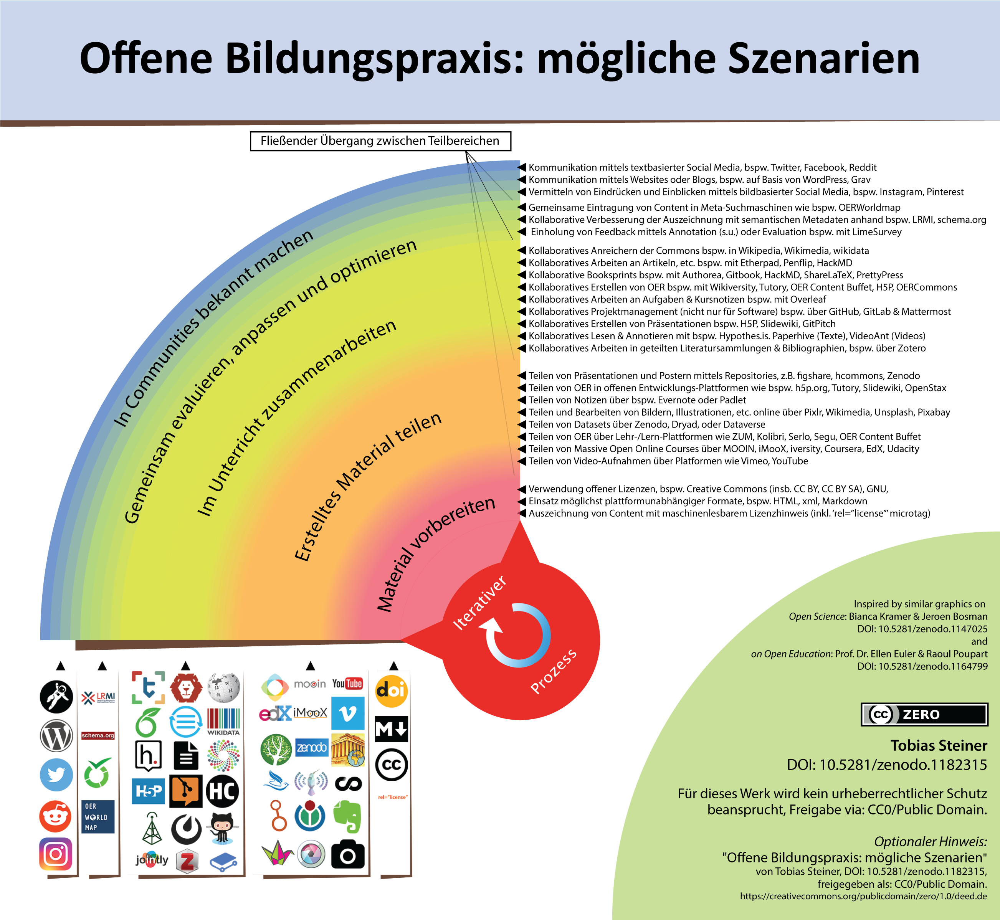

<meta charset="utf-8">

#### Versionshistorie

-   Version 1.0 -- 16. Oktober 2017 - Erste Version des Dokuments.
-   Version 1.1 -- 06. Juni 2018 - Website erstellt.
-   Version 1.2 -- Vervollständigter erster Entwurf (30. Juli 2018)
-   Version 2.1 -- Zweite überarbeitete Version (31. Dezember, 2018)

### Inhaltsverzeichnis

* [Zweck dieses Dokuments](#Purpose)
* [Strategie](#Strategy)
  * [Kurzfristige Strategie, \>2 Jahre](#Short)
  * [Mittelfristige Strategie, 2-5 Jahre](#Middle)
  * [Langfristige Strategie, 5+ Jahre](#Long)
* [Was ist Open Scholarship?](#What_is)
* [Stand der Bewegung](#State)
* [Wichtigste strategische Prioritäten zur Etablierung von Open Scholarship](#Priorities)
  * [Demokratisierung](#Democratization)
  * [Pragmatismus und Transparenz](#Pragmatism)
  * [Infrastruktur](#Infrastucture)
  * [Öffentliches Gut](#Public)
  * [Messung](#Measurement)
  * [Gemeinschaft und Integration](#Community)
* [Stärken der Open Scholarship-Bewegung](#Strengths)
* [Herausforderungen der Open Scholarship-Bewegung](#Challenges)
  * [Externe Bedingungen](#External)
  * [Interne Bedingungen](#Internal)
* [Chancen](#Opportunities)
* [Bedrohungen](#Threats)

**Wichtiger Hinweis:** Dieses Projekt befindet sich derzeit in Entwicklung und steht für offene Mitarbeit in [GitHub](https://github.com/Open Scholarship-Strategy/site) zur Verfügung. Bitte lesen Sie die [README-Datei](https://github.com/Open Scholarship-Strategy/site/blob/master/README.md) für weitere Details. Die Hauptinhaltsdatei findet sich [hier](https://github.com/Open Scholarship-Strategy/site/blob/master/index.Rmd).

*Anmerkung 2: Die finale Version dieses Dokuments wird als PDF (archiviert in Zenodo), als Rohdatenformat und als iPython-Notebook verfügbar sein.*

**Redaktion:**

[Jonathan Tennant](https://orcid.org/0000-0001-7794-0218)/* , Jonathan Dugan, Rachel Harding, Tony Ross-Hellauer, [Kshitiz Khanal](https://orcid.org/0000-0002-4765-4832), [Thomas Pasquier](https://orcid.org/0000-0001-6876-1306), [Jeroen Bosman](https://orcid.org/0000-0001-5796-2727), [Asura Enkhbayar](https://orcid.org/0000-0002-3934-026X), Gail Clement, [David Eccles](https://orcid.org/0000-0003-4634-4995), [Fiona Bradley](https://orcid.org/0000-0002-3622-2794), [(Bjoern Brembs)](https://orcid.org/0000-0001-7824-7650), (Pawel Szczesny), [Lisa Matthias](https://orcid.org/0000-0002-2612-2132), [Jesper Norgaard Kjaer](https://orcid.org/0000-0001-9183-9861), [Daniel S. Katz](https://orcid.org/0000-0001-5934-7525), [Tom Crick](https://orcid.org/0000-0001-5196-9389), [Christopher R. Madan](https://orcid.org/0000-0003-3228-6501), [Paul Macklin](https://orcid.org/0000-0002-9925-0151), [Johanna Havemann,](https://orcid.org/0000-0002-6157-1494), [Jennifer E. Beamer](https://orcid.org/0000-0001-6887-6568), [Michael Schulte-Mecklenbeck](https://orcid.org/0000-0002-0406-8809), Dan Sholler, Paola Masuzzo, [Tobias Steiner](https://orcid.org/0000-0002-3158-3136), [Tim Koder,](https://orcid.org/0000-0001-6152-7365), [David Nichols](https://orcid.org/0000-0003-0321-7267), [Daniel Graziotin](https://orcid.org/0000-0002-9107-7681), Alastair Dunning, [Andy Turner](https://orcid.org/0000-0002-6098-6313), [Neo Christopher Chung](https://orcid.org/0000-0001-6798-8867)

- /* [Kontakt](mailto:jon.tennant.2@gmail.com)
- Translation/Übersetzung ENG->GER: [Tobias Steiner](https://orcid.org/0000-0002-3158-3136)

## 1. Zweck dieses Dokuments 

**Dieses Dokument möchte einen möglichst breiten Konsens zur Findung einer internationalen Strategie zur Implementierung von Open Scholarship finden, die sowohl den Ansprüchen verschiedener nationaler und regionaler Communities gerecht werden kann, aber auch global funktioniert.**

Forschung kann ein inspirierender Prozess sein, um unser kollektives Wissen zum Nutzen der gesamten Menschheit weiterzuentwickeln. Die aktuelle Forschungspraxis sieht sich jedoch im aktuellen Prozess der Adaption an die digitale Welt noch mit einer Reihe von Spannungen und Konflikten konfrontiert. Das, was zumeist als *Open Scholarship* bezeichnet wird, ist hier als Ansatz gedacht, moderne Forschungs- und Lehr-/Lernpraktiken auf diese digitale Welt auszurichten. Wir schlagen keine normative Definition von Open Scholarship vor, sondern wollen anerkennen, dass es sich dabei um einen holistischen Begriff handelt, der das ganze  Spektrum wissenschaftlicher Disziplinen und damit einhergehender, sich unterscheidender Prinzipien und Praktiken umfasst, die in anderen Kontexten u.a. auch als Open Science, Open Research oder Digital Humanities bezeichnet werden (mehr dazu in [Punkt 3](#What_is)). Wir wählen den Begriff "Open Scholarship", um diese anderen Begriffe in einem universellen und konstruktiven Sinne inklusiv einzubinden.

Zweck dieses Dokuments ist es, eine präzise Analyse des aktuellen Standes der weltweiten Open Scholarship-Bewegung bereitzustellen: dies wird eine Auseinandersetzung mit Fragen nach gemeinsamen Gedankenstränge, nach Stärken der Bewegung und nach Potential und beinhalten. Abschließend wird dargestellt, wie wir als global vernetzte Gemeinschaft effizienter zusammenarbeiten können, um die wichtigsten strategischen Prioritäten zu erkennen und gemeinsam voranzubringen. Dieses Dokument wurde von den [Foundations for OER Strategy Development](http://www.oerstrategy.org/home/read-the-doc/) und der Arbeit der [FORCE11 Scholarly Commons Working Group](https://www.force11.org/group/scholarly-commons-working-group) inspiriert und durch eine offene Arbeitsgruppe gemeinsam kollaborativ entwickelt.

Wir hoffen, dass dieses Dokument als eine Grundlage für weiteren Austausch, Diskussionen und sich daraus entwickelnden Initiativen zur Umsetzung wirksamer Strategien dienen kann, um die Integration von Open Scholarship-Praktiken in eine sich entwickelnde, moderne, digitale Forschungskultur gemeinsam voranzubringen. Dadurch erhoffen wir uns, die Reichweite und Wirkung von Open Scholarship in einem globalen Kontext ausweiten und verstärken zu können, um damit sicherzustellen, dass es wirklich *offen für alle* ist. Wir hoffen auch, dass sich dieses Dokument im Laufe der zahlreichen Diskussionen über Open Scholarship weiterentwickeln und dazu beitragen wird, nützliche Erkenntnisse sowohl für die globale Koordination der Sache, als auch für direktes Handeln vor Ort zu liefern. Wir glauben, dass dies ein wichtiger Schritt vorwärts ist, um Open Scholarship zur Norm werden lassen zu können.

Letztendlich erwarten wir, dass sich die Auswirkungen einer weit verbreiteten Übernahme von Open Scholarship vielfältig äußern werden. Wir erhoffen uns, dass neuartige Forschungspraktiken das Innovationstempo erhöhen und damit wichtige Industriezweige weltweit stimulieren können. Durch Open Scholarship wäre auch eine Zunahme des Vertrauens der Öffentlichkeit in die Wissenschaft möglich, da Transparenz im Wissenschaftsprozess damit normativer wird. Daher erwarten wir, dass das Interesse an Open Scholarship aufgrund seines inhärenten Einflusses sowohl auf die Zivilgesellschaft als auch die Weltwirtschaft in Zukunft deutlich zunehmen wird.

## 2. Strategie 

"*Unter* [Strategie](https://en.wikipedia.org/wiki/Strategy) *wird in der Regel die Festlegung von Zielen, die Definition von Maßnahmen zur Erreichung dieser Ziele sowie die Mobilisierung von Ressourcen verstanden, welche zur Durchführung dieser Maßnahmen nötig sind. Eine Strategie beschreibt, wie die Ziele mit entsprechenden Mitteln (Ressourcen) erreicht werden können.*" (Übersetzung: T.S.)

Um die bestehenden Herausforderungen zu meistern und unsere gesteckten Ziele zu erreichen sollten wir uns auf unsere Stärken besinnen und auf diesen aufbauen. Im Folgenden haben wir drei zeitliche Hauptkomponenten (kurz-, mittel- und langfristig) einer Gesamtstrategie identifiziert, die als direkte Handlungsvorschläge auf individueller, Gruppen- und institutioneller sowie nationaler (oder höherer) Ebene genutzt werden können. Es muss verdeutlicht werden, dass damit das komplexe Wissenschaftssystem und seine zahlreichen Verknüpfungen und Abhängigkeiten  nicht vollständig abgebildet werden kann. Daher sehen wir es als notwendig, dass sich die unterschiedlichen Disziplinen auch selbst auf ihren jeweiligen Ebenen damit auseinandersetzen, welche Aktivitäten in den entsprechenden Fachkulturen angemessen erscheinen. Hierzu kann diese Strategie als Basis für eine konstruktive Auseinandersetzung in der eigenen Fachkultur und darüber hinaus dienen.

Daher besteht eines der grundlegenden Ziele dieser Strategie darin, die Ausformung von Communities zu fördern, die sich gegenseitig durch gemeinsames, verteiltes und kollaboratives Lernen weiterbilden und Wissen zu aktuellen Entwicklungen in der Welt des Open Scholarship austauschen. Diese Communities haben unserer Ansicht nach den direktesten Einblick in die spezifischen Herausforderungen und können daraus direkt anwendbare Handlungsvorschläge generieren, um diese Herausforderungen zu meistern. Aus diesen Handlungsvorschlägen wiederum können mittelfristig neue Perspektiven auf die unterschiedlichen hierarchischen Ebenenen generiert werden, die dann in Entscheidungsfindungs-Prozesse einfließen können.

Wir stellen fest, dass diese Strategie aufgrund der Vielfalt der Akteure und Stakeholder sowie unterschiedlicher Perspektiven, Praktiken und Interessen kein Grundkonsensdokument sein kann. Daher wird die Priorisierung der verschiedenen Aspekte aus unterschiedlichen Perspektiven diskutiert. Eine Wirksamkeit wird sich dann einstellen, sobald Einzelpersonen und Communities verschiedene Teile dieser Strategie in ihren jeweiligen Kontexten entlang der Veränderung kultureller Normen hin zu offeneren Gegebenheiten realisieren können. In der Tat sehen viele den Fortschritt der Open Scholarship-Bewegung in den vergangenen zwei bis Jahrzehnten als fast schon schmerzhaft substanzlos an; ein Faktor, der sicherlich auch mit einem Mangel an strategischer Planung und entsprechend gesteuerter Umsetzung zu tun haben könnte.

Wir stellen ebenso fest, dass diese Strategie nur auf Informationen basieren kann, die wir als Kollektiv zum aktuellen Zeitpunkt beitragen können, und es ist sehr wahrscheinlich, dass es noch zahlreiche Initiativen, Policies und Programme, Tools und Plattformen gibt, die wir ungewollt übersehen haben. Ebenso kann es auch gut sein, dass wir schon bestehende Strategien hier nicht in Betracht gezogen haben. Nichtsdestotrotz wollen wir mit diesem Dokument versuchen, unseren Strategieanansatz nach bestem Wissen und Gewissen mit Fakten und Argumenten zu untermauern; die entsprechenden Diskussionen dazu sind unter dem Strategie-Abschnitt in Sektion 5 zu finden.

### 2.1 Kurzfristige Strategie (>2 Jahre) 

**Individuelle Ebene**

-   Für Förderorganisationen, Regierungen und Forschungseinrichtungen: Übernahme von Richtlinien und Mandaten im Zusammenhang mit Open Scholarship-Praktiken jenseits von Open Access (OA) und Datenaustausch, z.B. zu Open Peer Review, Verwendung von Persistent Identifiers (PIDs), Open Research Evaluation und Preprints. Darüber hinaus Einsatz für offene Bildung / Open Education mit entsprechenden Praktiken, um die Verbreitung von Openness-Ansätzen unter Peers sowie den nächsten Generationen von Wissenschaftlerinnen und Wissenschaftlern zu fördern.

-   Mache die Beiträge einer Person zu Openness in der Öffentlichkeit sichtbar (z.B. per Lebenslauf, offenen Plattformen oder einer persönlichen Webseite/Blog).

  - Nutze diese Beiträge aktiv, um Best Practice-Beispiele herauszuarbeiten.

-   Verfolge einen breit angelegten Ansatz für die Vielfalt offener wissenschaftlicher Forschungs- und Bildungspraktiken (Practices of Open Science/Scholarship). Vgl. dazu bspw. [FOSTER Open Science Taxonomy](https://www.fosteropenscience.eu/resources).
    -   Grundlegend: Beginne mit der [offenen Zugänglichmachung der eigenen Arbeitsergebnisse](https://cyber.harvard.edu/hoap/How_to_make_your_own_work_open_access).

-   Nutze Open Source-Software für die Durchführung von Forschung und Lehre und dokumentiere diese entsprechend, so dass die computerisierte Verarbeitung von der Wissenschaftscommunity überprüft werden kann, und so, dass die verwendeten Werkzeuge für alle verfügbar sind, um die Produktivität und Zusammenarbeit zu erhöhen. Zur Unterscheidung zwischen open, free, gratis und libre siehe z.B. [OpenSource.com](https://opensource.com/article/17/11/Open source-or-free-software)(englisch), [Stallmann,2013](https://www.gnu.org/philosophy/floss-and-foss.de.html)(englisch) oder [Dobusch et al. 2011 (Kapitel 4)](http://www.freienetze.at/pdfs/Freiheit-vor-Ort-E-BOOK.pdf)(deutsch).

-   Verpflichte Dich auf persönlicher Ebene zu einer Vielzahl von Open Scholarship-Praktiken, wie z.B. dem Austausch von Forschungsdaten und Lehr-/Lernmaterialien in freien, offen lizenzierten Formaten, so dass Ansätze, Methoden und Ergebnisse für Lehre und Forschung von der breiten Gemeinschaft offen geprüft und weiterentwickelt werden können.

-   Verpflichte Dich zum Austausch von Preprints für die offene und schnelle Verbreitung Deiner Arbeit.

-   Etabliere und fördere Wiederverwendungs- und Remix-Praktiken, u.a. durch

   -   die Suche nach vorhandenen Daten, die Du wiederverwenden/remixen kannst, anstatt eigene neue Daten zu erstellen,

   -   das Schreiben/Hinterlassen von **konstruktiven** Kommentaren & Hinweisen zu Preprints/Code etc. mit offenen Werkzeugen wie [hypothes.is](https://web.hypothes.is/),

   -   das Anbieten von Hilfe bei der Beantwortung von Fragen in offenen Foren wie [Ask Open Science,](https://ask-Open science.org/), [Stack Overflow](https://stackoverflow.com/) und auf Twitter,

   -   eine positive Reaktion auf Anfragen zu open peer reviews.

-   Unterstütze den Aufbau von Support-Strukturen (z.B. offene Werkstatt-Angeboten, openLabs, walk-in Labs und andere Supportangebote, auch makerspaces im weiteren Sinne)(für einen aktuellen Überblick im deutschen Kontext, siehe [Fachmagazin Synergie](https://uhh.de/rtzse)), die andere Personen auf dem Weg zu Open Scholarship begleiten. Dazu kann Unterstützung bei Fragen nach offenem Publizieren, Offener Lehre, Offenem Lernen und Offenem Forschen genauso gehören wie die Frage, welche Werkzeuge/Tools/Programme beispielhaft dafür zur Verfügung stehen und wie diese genutzt werden können (siehe Abbildungen 1 und 2 und Abschnitt *Gruppenebene*).

[Kramer, Bianca, & Bosman, Jeroen (2018, Januar). Rainbow of open science practices. Zenodo](https://doi.org/10.5281/zenodo.1147024). (CCBY)

[Steiner, Tobias (2018, Februar). Offene Bildungspraxis: Mögliche Szenarien. Zenodo](https://doi.org/10.5281/zenodo.1181884). (CC0)

-   Baue Beziehungen zu anderen Akteuren, die an der Entwicklung von Open Scholarships beteiligt sind (z.B. Bibliothekare, politische Entscheidungsträger, Verlage und andere Dienstleister, Open Access-Befürworter und aktive Lehrkräfte sowie IKT- und andere Unterstützungspositionen für Wissenschaft und Bildung) auf bzw. vertiefe bestehende Beziehungen.

-   Kooperiere und arbeite mit Forschern zusammen, die verschiedene Aspekte von Open Scholarship praktizieren; diese können von der Entwicklung von Open Source-Software und -Werkzeugen bis hin zur Veröffentlichung von Preprints und der Förderung von Citizen Science und dem Austausch von Erfahrungen mit Ansätzen zu offener Bildung/Open Education reichen.

-   Entwickle und fördere eine offene, konstruktive Weltsicht ("open mindset"), die die Bedeutung des Forschungs**prozesses** in den Fokus rückt und eine offene Fehlerkultur zulässt.

-   Unterzeichne die San Francisco Declaration on Research Assessment [(DORA)](https://sfdora.org/), um deutlich zu machen, dass Du dich der Verbesserung der Bewertung/des Assessment von Forschung verschreibst. Achte auch in der persönlichen Praxis auf die Einhaltung der DORA-Grundsätze.

  -   Als Alternative kann das [Leiden Manifesto](http://www.leidenmanifesto.org/) dienen.

-   Als im Bildungskontext tätige Person: Unterzeichne die [Cape Town Open Education Declaration](http://www.capetowndeclaration.org/sign-the-declaration), um dich der Einhaltung der drei Strategien der Erklärung als Teil des Lehr-, Lern- und/oder Arbeitslebens zu verpflichten.

   -   Falls Du noch mehr tun möchtest: Beachte die [Zehn Richtungen, um Open Education voran zu bringen](http://www.capetowndeclaration.org/cpt10/de/).

-   Verweigere die Unterzeichnung von Urheberrechtsübertragungsverträgen, es sei denn, Dir wird das Recht an der Weiternutzung Deines Werkes unter einer [Creative-Commons-Lizenz](https://creativecommons.org/licenses) Deiner eigenen Wahl eingeräumt.

**Gruppenebene (z.B. Labore, Abteilungen)**

-   Mache Open Scholarship-Hotspots (d.h. Orte, Events oder Gruppen für einen regelmäßigen Austausch und die Diskussion über Community Building) ausfindig und finde einen Weg, diese miteinander in Kontakt und Austausch zu bringen, um Zusammenhalt und Expansion der Community zu fördern.

  -   Sollte ein solcher in Deiner Nähe noch nicht existierten: Richte einen lokalen Open Scholarship-Hotspot (z.B. über die [Meetup-Plattform](https://www.meetup.com/)) ein.

  -   Nutze diese nationalen/internationalen/regionalen Gemeinschaften, um das Lernen und den Wissensaustausch über Open Scholarship-Praktiken auf niedrigschwelliger Ebene, insbesondere in unterschiedlichen kulturellen Umgebungen, zu unterstützen.

  -   Starte Diskussionen zu einem impliziten oder expliziten (gemeinsamen) Open Science/Open Scholarship-Verhaltenskodex oder einer entsprechenden Satzung für Ihre Abteilung, Ihren Fachbereich, etc. Als Inspiration können schon bestehende Kodizes wie bspw. der [Contributor Covenant](https://www.contributor-covenant.org/de/version/1/4/code-of-conduct) dienen.

-   Stelle sicher, dass Rechteexpertinnen und Rechtsexperten zum Themnfeld des Open Scholarship zur Verfügung stehen, die bei Fragen zu Lizenz- und Urheberrecht sowie der richtigen Nutzung von Creative Commons-Lizenzen behilflich sein können. Im deutschsprachigen Kontext kann zur Rechtsfragen und -Beispielfällen bspw. das Portal [irights.info](https://irights.info) eine hilfreiche Anlaufstelle sein.

-   Mache Best-Practice-Beispiele als showcases sichtbar, um zu zeigen, was mit Open Scholarship tatsächlich möglich ist und was die weiteren Vorteile sein können.

-   Binde Kommunikationsabteilungen und Forschungs-Assessment-Beauftragte enger mit ein. Organisiere Sitzungen, um diese Stakeholder über Open Science und Open Scholarship zu informieren. Sei dir dabei der Tatsache bewusst, dass es für Mitarbeitende dieser Bereiche bedeuten kann, dass sie ihre eigene Sichtweise zu Wissenschaft, deren Handlungsfeldern sowie ihrer eigenen Rolle in diesem Wissenschaftssystem neu ausrichten werden.

-   Adaptiere Best Practices für Open Scholarship, einschließlich gemeinsamer Daten als Forschungsergebnisse, die sich mit den Themen des "publication bias" sowie "fragwürdigen Forschungspraktiken" auseinandersetzen und bias-reduzierende Workflows als Alternative begreifen.

-   Halte Fürsprache bei Entscheidungsträgern von wissenschaftlichen Zeitschriften, Verlagen, Förderern, Hochschulen und Forschungseinrichtungen, um eine Vielzahl von Open Scholarship-Aktivitäten anzuerkennen und zu belohnen, insbesondere im Hinblick auf Forschungsevaluation und Open Education Policies.

-   Nimm Gespräche mit Anbietern von Hochschulranking-Diensten (z.B. QS, Times Higher Education (im Kontext UK), CHE (im Kontext DE)) auf, um ein Offenheitselement in die zugrundeliegenden Indikatoren zu integrieren.

-   Stoße Debatten über sinnvolle Standards und Praktiken auf fachlicher Ebene für die Veröffentlichung von Daten in Deiner Institution und darüber hinaus an (z.B. die Einhaltung der [FAIR-Prinzipien)](https://www.go-fair.org/fair-principles/). Achte bei der Er- und Bereitstellung von OER auf die Gewährleistung der ["Fünf V-Freiheiten"](https://www.hoou.uni-hamburg.de/information/was-ist-oer.html#Die%205%20V-Freiheiten).

-   Verbessere den Austausch zwischen Fakultätsbeiräten, Forscherinnen und Forschern, Studierenden und Bibliotheksmitarbeitenden in Bezug auf Open Scholarship-Praktiken (siehe Abb. 1 und 2) und deren zugrundeliegenden Prinzipien.

-   Verweigere dich einer Zusammenarbeit mit Verlagen, die an restriktiven Preprint-, Open Access- und Copyright-Richtlinien festhalten.

**Institutsebene (einschließlich Forschungs- und Fördereinrichtungen)**

-   Forschungsbibliotheken sollten generell Informationen darüber sammeln, wie der Forschungssektor als Ganzes mit Forschungsliteratur interagiert. Folgende Informationen könnten sich als hilfreich bei Verhandlungen mit Verlagen erweisen und Argumentationshilfen für das Aufbrechen von Sammelverträgen und Groß-Abonnements liefern, indem sie den branchenübergreifenden Wert von Diensten belegen:

  - Welche Journals und Verlage wählen Forschende für ihre Publikationen?

  - Wer leistet tatsächlich redaktionelle sowie Peer-Review-Arbeit?

  - Welche Summen werden für Journal-Abonnements ausgegeben?

  - Welche Summen werden im Bereich Open Access für Artikelbearbeitungsgebühren bzw. article processing charges (APCs) und Buchbearbeitungsgebühren / book processing charges (BPCs) ausgegeben?

  - Welche Artikel werden tatsächlich heruntergeladen und zitiert?

-   Verschaffe Dir einen aktuellen, koordinierten Überblick darüber, zu welchem Zeitpunkt welche Abonnements und Lizenzvereinbarungen über Forschungsinstitutsgrenzen hinweg auslaufen, und lasse dies geschehen. Wo immer Stornierungen oder Kündigungen von Abonnements auftreten, ist sicherzustellen, dass ein angemessener Zugang zu Artikeln und entsprechender Support nach Auslauf des Abonnement unter Nutzung bestehender legaler Mechanismen (z.B. Fernleihe) gewährleistet wird. Erkundige dich nach Wegen zur Reinvestition von eingesparten Mitteln in nachhaltige Bibliotheksbudgets.

-   Kaufe Altdokumente von Verlagen zurück und binde sie in den offenen wissenschaftlichen Gesamtkreislauf ein. Verbessere zudem die offene Verfügbarmachung und Archivierung von Werken, deren Urheberrecht abgelaufen ist.

-   Hilf Forschenden, sich über Möglichkeiten einer ["Termination of Transfer" (nach der Definition der Authors' Alliance)](https://www.authorsalliance.org/resources/termination-of-transfer/) zu informieren, um ihnen Wege aufzuzeigen, ihre Autorenrechte behalten zu können. Hier sei insbesondere auch auf das [Termination of Transfer Tool](https://rightsback.org/) hingewiesen.

-   Forschungsförderinstitutionen können bestimmte Grenzen eines für sie akzeptablen Publikationsstandards definieren. Sie können daher auch darauf hinwirken, Veröffentlichungen in wiss. Journals mit einer Obergrenze für APCs und BPCs zu belegen, oder Veröffentlichungen bei reinen Open Access-Verlagen (mit OA-spezifischen Lizenzen) oder in solchen mit vergleichsweise kurzen Embargofristen (bis hin zum Null-Embargo) zur Selbstarchivierung (grünes OA, z.B. Emerald, The Royal Society) zu verlangen.

-   Weigere dich, mit Verlagen zusammenzuarbeiten, die sog. "[Double Dipping](http://www.rluk.ac.uk/about-us/blog/the-costs-of-double-dipping/)" praktizieren, und fordere Transparenz und die Bereitstellung entsprechender Daten, falls der Verdacht besteht, dass dies der Fall ist (für einen Überblick siehe z.B. [Buranyi, 2017)](https://www.theguardian.com/science/2017/jun/27/profitable-business-scientific-publishing-bad-for-science).

-   Weigere dich, mit Verlagen zusammenzuarbeiten, bei denen es keine Transparenz über das Preismodell für Abonnements oder Open Access gibt. Dies gilt auch für Verlage, die auf Vertraulichkeitsvereinbarungen als Teil der Lizenzvertragsbedingungen bestehen.

-   Wirke im Dialog mit Verlagen darauf hin, mehr Transparenz in Bezug auf die finanziellen Aspekte ihrer Publishing-Workflows zu etablieren. Als Positiv-Beispiel kann hier [Ubiquity Press](https://www.ubiquitypress.com/site/publish/) dienen.

-   Bestehe darauf, dass Verlage alle bibliographischen Daten, Nutzungsmetriken und Zitationsdaten sowohl in für Menschen lesbaren als auch in einem maschinenlesbaren Format frei verfügbar und zugänglich machen.

-   Wirke auf eine Entwicklung von Richtlinien zur Wahrung von Rechten für Forschung an Forschungsinstituten hin, an denen diese derzeit noch fehlen.

-   Erwäge eine Adaption der [CASRAI CRediT](http://docs.casrai.org/CRediT)(Contributor Rules Taxonomy)-Richtlinien, um Beiträge der Autorinnen und Autoren klarer zu identifizieren.

-   Weigere dich, mit Verlagen zusammenzuarbeiten, die über restriktive Preprint-, Open Access- und Copyright-Richtlinien verfügen.

-   Fördere die Verbreitung der [Initiative for Open Citations](https://i4oc.org/) (I4OC) bei Verlagen gemeinsam mit einer grundlegenderen Förderung der breiten Akzeptanz offener Standards.

-   Für Forschungsinstitutionen, an denen sie derzeit fehlen: rege die Einrichtung und nachhaltige Pflege eines Open Access-Repository an oder identifiziere schon vorhandene Ressourcen, die für diesen Zweck genutzt werden können. Führe zudem eine [Open Access-Policy](https://cyber.harvard.edu/hoap/Good_practices_for_university_Open access_policies) ein und mache diese auf der institutionellen Website und allen relevanten Indexierungsdiensten leicht auffindbar und zugänglich.

  - Beispiele für Open Access-Policies finden sich z.B. über die [ROARMAP](https://roarmap.eprints.org/cgi/search/advanced)
  - Beispiele für Open Education / OER-Policies sind z.B. im [Creative Commons OER Policy Registry](https://wiki.creativecommons.org/wiki/OER_Policy_Registry) oder in den [Policy approaches to Open Education, 2017](https://doi.org/10.2760/283135) der Europäischen Union aufgeführt.

-   Unterstütze die Förderung und leiste entsprechende Kompensation von investierter Zeit und Arbeit für Trainings- und Interessensvertretungstätigkeiten zu den verschiedenen Aspekten von Open Scholarship, einschließlich Open Source, Open Access und Open Education.

-   Ermögliche und fördere lokale Supportstrukturen wie Openlabs, Makerspaces und Lern-, Orientierungs- und Beratungsangebote für Open Publication, Open Science und Open Education.

-   Arbeite mit Forschungs-Communities zusammen, um quantifizierbare Anreize für den Austausch von Preprints, Open Data, reproduzierbaren Analysedaten und Open Access generell bei Einstellungs-, Beförderungs- und Berufungsverfahren zu entwickeln und zu bewerben. Definiere neue Wege, um die Vorteile dieser Anreize der breiteren Wissenschaftcommunity verständlich zu machen.

-   Adaptiere und fördere die in DORA festgelegten Prinzipien für ein gerechteres Assessment von Forschung. Stelle sicher, dass die für diese Art von Assessment Verantwortlichen, einschließlich Einstellungs-, Berufungs- und Förderausschüsse, sich an diese halten.

-   Überlege, closed source-Software mit Open Source-Alternativen zu ersetzen.

-   Setze sowohl in persönlicher Forschungsarbeit als auch im Austausch mit anderen Forschenden auf offene Standards und Dateiformate bei der Bereitstellung von Dokumenten und Daten (entweder ausschließlich oder mindestens zusätzlich zur Bereitstellung von geschlossenen Standards und Dateiformaten).

**Nationale Ebene (oder darüber hinaus)**

-   Schaffe neue oder trete in Kontakt mit bzw. unterstütze bestehende internationale Bibliothekskonsortien/-Kooperationen (z.B. die [International Coalition of Library Consortia)](http://icolc.net/)), um bei der Infrastrukturentwicklung zusammenzuarbeiten (z.B. [LIBER,](https://libereurope.eu/), [EIFL,](http://www.eifl.net/), [ARL](http://www.arl.org/) und [SPARC)](https://sparcopen.org/).

-   Werde Mitglied bei der Global Sustainability Coalition for Open Science Services [(SCOSS)](http://scoss.org/), und erörtere eine mögliche Koalition mit der [Open Research Funders Group](http://www.orfg.org).

    -   Konsortien wie das deutsche [Projekt DEAL](https://www.projekt-deal.de/) können als Beispiel dafür gelten, wie auf nationaler Ebene ein erster Schritt in diese Richtung gegangen werden kann. Hier die Unterstützung von SPARC einzuholen, wäre sicherlich ebenfalls nützlich.

    - Ziehe aktuelle Entwicklungen zum Europäischen [Plan S](https://www.coalition-s.org/about/) für deinen spezifischen nationalen oder regionalen Kontext in Betracht. Beachte dazu insbesondere, was getan werden kann, um eine [Implementierung von Plan S](https://www.coalition-s.org/wp-content/uploads/271118_cOAlitionS_Guidance.pdf) in deinem Kontext voranzubringen. Weiterführende Literatur: [Kramer & Bosman, 2018](https://101innovations.wordpress.com/2018/11/30/nine-routes-towards-plan-s-compliance/)

-   Baue auf die Unterstützung von Mitarbeitenden und Geldgebern für Open Access und damit verbundene Qualitätssicherungsinitiativen (z.B. Peer Review), die vom Verlags- und Journal-Kreislauf entkoppelt sind. Vereinbare eine Governance-Struktur, die weltweite Infrastrukturen (z.B. [W3C)](https://www.w3.org/)) mit einbezieht, und entwickle diese kontinuierlich weiter.

-   Schaffe wissenschaftliche Standards zur Implementierung einer gemeinnützigen non-profit Publikationsplattform/-umgebung (unter Einsatz der durch ausgelaufene Abonnements freigewordenen Mittel, und aufbauend auf bestehenden Repositorien/Umgebungen und digitaler Forschungsinfrastruktur).

-   Unterstütze Kooperationen wie [Metadata 2020,](http://www.metadata2020.org/), [NISO/NIST](https://www.niso.org/) und [eLife,](https://elifesciences.org/), um wissenschaftlichen Kommunikationssystemen und Communities besser miteinander zu vernetzen.

-   Initiiere Maßnahmen gegen die Privatisierung wissenschaftlicher Publikationen und Prozesse, um eine Veränderung der Verlagsbranche hin zu einem Verlagssystem zu erreichen, das auf faire Lizenzierung, fairen Wettbewerb und der Einhaltung der Eigentumsrechte der wissenschaftlichen Gemeinschaft setzt.

-   Erstelle eine Kosten-Nutzen-Analyse zu Open Scholarship (z.B. Übersicht der tatsächlich anfallende Kosten der Veröffentlichung von Artikeln), die als Grundlage für die Auseinandersetzung mit der Frage dienen kann, welche Summe an Steuergeldern jedes Jahr dadurch ausgegeben werden, wenn zu treffende Entscheidungen in den oben genannten Bereichen weiter verzögert werden.

-   Führe moderne Sortier-, Filter- und Suchtechnologien (semantic web) für allen bereitzustellenden Wissenschafts-Output ein.

-   Ermögliche uneingeschränktes Text- und Data-Mining für diese Inhalte.

-   Forschungsförderungs-Institutionen und Bibliotheken halten zumeist den größten Teil der verfügbaren Mittel unter ihrer Kontrolle. Daher ist weitergehendes Engagement dieser Stakeholder unerlässlich, insbesondere bei der Definition ihres diesbezüglichen Rollenverständnisses bei der Entwicklung und Finanzierung von Wissenschafts-Infrastruktur. Ein "Einfach weiter so", mit dem wie bisher Geld in das bestehende System mit kontraindizierten Anreizen und verzerrter Machtdynamik geleitet wird, ist für die Forschung insgesamt nicht mehr tragbar.

-   Wirke an der Entwicklung nachhaltiger Roadmaps für Open Scholarship auf regionaler und nationaler Ebene mit.

-   Ermutige an der Forschungsförderung Beteiligte zur Diversifizierung des Portfolios dessen, was für Assessment-Zwecke als Forschungsergebnis angesehen wird.

    -   Dies beinhaltet die weitergehende Adoption von Preprint- und Open Access-Policies ähnlich denen der [NIH (USA)](https://publicaccess.nih.gov/policy.htm) und des [Wellcome Trust (UK)](https://wellcome.ac.uk/funding/guidance/open-access-policy).

-   Ermutige Forschungsförderer bei der Entwicklung von Aufrufen zur Unterstützung von evidenz- und theoriebasierten Interventionen zur Förderung von Open Scholarship.

    * Fördere Studien, die anhand von behavior change theory die Kriterien und Einflussfaktoren des aktiven Engagements in unterschiedlichen Open Scholarship-Feldern und -Praktiken untersuchen (bspw.um zu erforschen, wieso manche Forschenden wiederholt und routiniert Preprints veröffentlichen, während andere sich dieser Praktik verschließen...)

    * Fördere Studien, die anhand der stakeholder theory Herangehenweisen untersuchen, wie vermehrt Open Scholarship-Policies an Foschungs- und Bildungsinstitutionen etabliert werden können.

-   Erwirke eine Reduzierung der Artikelbearbeitungsgebühren/article processing charges (APCs) und Buchbearbeitungsgebühren/book processing charges (BPCs) bei Hybrid-Titeln, um dem Marktdurchschnitt für reine Open Access-Zeitschriften und Verlage zu entsprechen.

    -   Der wissenschaftliche Publikationsmarkt könnte eine detaillierte Untersuchung auf Regierungsebene erfordern, um dies nachhaltig zu stabilisieren.

-   Wirke auf die Verwendung von [ORCID](https://orcid.org/)-Identifiern für Forschende im gesamten Forschungsoutput hin, um eine persistente Identifizierung von Autorinnen und Autoren in der gesamten Forschungsliteratur zu unterstützen und die Auffindbarkeit von Forschungsergebnissen zu erleichtern.

-   Wenn Journal-Abonnements noch nicht abgelaufen sind, erwirke Ausgleichsvereinbarungen für Hybrid-Journals (OA/non-OA), um Double-Dipping seitens der Verlage zu reduzieren.

-   Wo Ausgleichs- und/oder Kompensationsvereinbarungen bestehen, können diese gestrafft und sektorübergreifend standardisiert werden, um den anfallenden Verwaltungsaufwand zu reduzieren.

-   Arbeite darauf hin, dass Wissenschaftsverlage sich mit der neuen [UK Scholarly Communications License](http://ukscl.ac.uk/) auseinandersetzen, die es Autorinnen und Autoren ermöglicht, weitergehende Rechte an ihren publizierten Werken zu behalten. Dies würde den Zeitaufwand für Embargofristen und deren Verwaltung, die Kosten für hybride APCs und BPCs reduzieren. Forschende im Vereinigten Königreich/UK können zudem dabei unterstützt werden, die [UKRI Open Access policy](https://www.ukri.org/funding/information-for-award-holders/Open access/Open access-policy/) zu beachten und einzuhalten.

    -   Forschende, die nicht im Vereinigten Königreich ansässig sind, können darauf hinwirken, eine auf die Förderungs- und Lizenzierungsanforderungen anderer Regionen erweiterte Adaption des [UKSCL](http://ukscl.ac.uk/) (oder relevanter Variationen davon) zu erarbeiten und einzuführen.

-   Führe sektorübergreifend eine bedingungslose Gebührenbefreiung für Forschende aus Ländern mit niedrigem bis mittlerem Einkommen oder mit nachweisbarem finanziellem Bedarf ein.

-  [Wandle](https://nrs.harvard.edu/urn-3:HUL.InstRepos:27803834) (oder flippe) die Mehrheit der verfügbaren wissenschaftlichen Journals vom Bezahl-/Abonnement-Modell hin zu Open Access entsprechend den Befürfnissen der entsprechenden Wissenschaftscommunities.

-   Lade alle [relevanten Akteure](https://doi.org/10.3233/ISU-170839) einschließlich Universitäten, Forschungseinrichtungen, Fachgesellschaften, Geldgeber, Bibliotheken und Verlagen dazu ein, konstruktiv an einem Übergang zu offenen Forschungs- und Bildungsspraktiken zum Nutzen der Wissenschaft und der Gesellschaft insgesamt mitzuwirken.

-   Erstelle Showcases und Good Practice-Beispiele von Open Scholarship-Praktiken auf nationalen Websites oder Portalen, zusammen mit relevanten Informationen und Ressourcen.

-   Fördere die Erstellung und Bereitstellung von Open Science-Trainingskursen in Graduiertenschulprogrammen und darüber hinaus. Als Beispiel kann das Open Science-Toolkit von [FOSTER](https://www.fosteropenscience.eu/toolkit) oder der [OpenScienceMOOC](https://opensciencemooc.eu/) dienen.

-   Fördere die in [DORA](https://sfdora.org/read/) dargelegten Grundsätze für ein gerechteres Assessment von Forschungsleistungen, und adaptiere diese an Dein eigenes Umfeld. Stelle sicher, dass die für Forschungs-Assessment Verantwortlichen, einschließlich der Einstellungs- und Berufungsausschüsse sowie für die Vergabe von Grants und Forschungszuschüssen verantwortlichen Komitees, sich an diese halten.

## 2.2 Mittelfristige Strategie (2-5 Jahre) 

Zu gegenwärtigen Zeitpunkt wird davon ausgegangen, dass Teile der kurzfristigen Strategie auf der Grundlage der Bedürfnisse der jeweiligen Gruppen bereits eingeleitet wurden und sich entweder in der Umsetzung oder in der vorbereitenden Entwicklung befinden. Häufig handelt es sich um fluide und kontinuierliche Prozesse, die sich mit der mittelfristigen Strategie überschneiden können und daher an dieser stelle nicht explizit wiederholt werden. Alle in der [Kurzfristigen Strategie](#Short) genannten Punkte sind daher je nach Entwicklungstempo genauso relevant.

**Individuelle Ebene**

-   Arbeite weiterhin an der Einführung neuer Forscher/innen in Best Practices zum Thema Open Scholarship.

    -   In Bereichen, in denen dies bisher noch nicht der Fall ist, könnte der Aufbau strategischer Netzwerke zur Lobbyarbeit für Openness verstärkt werden.

-   Stelle sicher, dass alle Forschungsprozesse und -ergebnisse im persönlichen Umfeld, einschließlich früherer Publikationen und Forschungsdaten, offen lizenziert und für die Wiederverwendung an geeigneten Orten verfügbar sind.

-   Entwickle Workflows, die auf die Vorteile von Open Scholarship-Praktiken setzen, um die vergleichsweise höhere Effizienz im Vergleich zu herkömmlichen Workflows in proprietären Systemen im Best Practice-Sinne sichtbar zu machen.

-   Fördere weiterhin Innovationen in neuen Forschungsprozessen und Arbeitsabläufen, wenn neue Dienstleistungen, Absatzmöglichkeiten und Technologien verfügbar werden.

-   Nutze semantische Web-Technologien, um bereits existierende und neu entwickelte Forschungsergebnisse zu verbreiten; dies kann bspw. Tagging (siehe z.B. Ansätze wie [OATP](https://tagteam.harvard.edu/hubs/oatp/items), Netzwerk-Visualisierungen wie das Publikations-Netzwerk zum Themenbereich *Offenheit und Bildung* von [DeVries, Rolfe, Jordan und Weller, 2017)](http://www.katyjordan.com/go_gn/network/), oder die Kommentierung/Annotation bestehender Inhalte bspw. mit [Hypothes.is](https://hypothes.is) beinhalten.

-   Entwickle die in der kurzfristigen Strategie (Abschnitt 2.1) genannten Aspekte weiter.

**Gruppenebene**

-   Wirke an der Schaffung einer umfassenden Mechanismen-Sammlung mit, die eine vollständige Öffnung der Forschungsprozesse für die Öffentlichkeit ermöglichen (bspw. kein Mitziehen von inhaltlich unbeteiligten Autor*innen, keine "menschlichen Verarbeitungseinheiten" mehr usw.).

-   Binde alle Gruppenmitglieder in die Entwicklung von Open Scholarship-Workflows ein, die die Vorteile einer sich stetig weiterentwickelten Wissenschafts-Infrastruktur und darin enthaltener Tools nutzten.

    -   Stelle sicher, dass alle Gruppenmitglieder in einer Vielzahl von relevanten Fähigkeiten und Fertigkeiten geschult werden; dazu kann öffentliches Engagement und die Entwicklung von Policies und Richtlinien genauso zählen wie die Durchführung von Datenanalysen, Webentwicklung oder die Förderung von Citizen Science und Wissenschaftskommunikation.

-   Ermögliche Einblicke sowohl in lokale als auch darüber hinausgehende Entwicklungen und Erfolgsgeschichten aus der gelebten Praxis des Open Scholarship.

-   Setze den Aufbau und die Stärkung der lokalen Open Scholarship-Communities gewissenhaft fort und binde Nachwuchswissenschaftlerinnen und -wissenschaftler sowie Studierende mit ein.

-   Entwickle die in der Kurzfriststrategie (Abschnitt 2.1) genannten Aspekte weiter.

**Instituts- / Arbeitsbereichs-Ebene**

-   Implementiere Opt-Out-Automatisierung und One-Click-Übermittlung zu lokalen oder anderen Repositorien als Teil des Journal-Publikationsprozesses.

    -   Implementiere eine Opt-Out-Automatisierung der Ablage von Forschungsdaten unter standardmäßig offenen Lizenzen (bspw. CC0, CC BY).

    -   Implementiere eine Opt-Out-Automatisierung von Code-Accessibility-Features sowie einer Versionskontrolle unter standardmäßig offenen Lizenzen.

    - Implemente den Mechanismus einer One-Click-Einreichung in vorhandenen Repositories (siehe [HAL](https://www.ccsd.cnrs.fr/en/2018/06/new-interface-for-submitting-in-hal-a-first-assessment/)) oder adaptiere bestehende Tools, umd diesen Zweck zu erreichen (bspw. [Dissemin](https://dissem.in/)).

    - Befülle offene Repositorien retroaktiv mit Volltexten aller Werke, die den Status der Gemeinfreiheit erreicht haben, unter entsprechenden offenen Lizenzen veröffentlicht wurden oder eine freie Verfügbarmachung anderweitig durch Copyright-Ausnahmen und andere Richtlinien ermöglicht wird. Unterstütze zudem Autorinnen und Autoren, dasselbe für weitere und zukünftige Werke zu tun.

-   Nutze eingesparte Ressourcen, die derzeit für Abonnements von Zeitschriftenabonnements ausgegeben werden, zur Ausfinanzierung von Fonds zur Unterstützung nachhaltiger Open Access-Geschäftsmodelle, wissenschaftlicher Infrastruktur und anderer relevanter Support-Dienste.

-   Entwickle und vermittle Kurse zu den verschiedenen Praktiken des Open Scholarship bzw. biete diese selbst an (z.B. als grundständiges Angebot an Seminaren/Workshops von Graduiertenkollegs).

-   Setze die Zusammenarbeit mit anderen Forschungsinstituten fort, um Ressourcen, Infrastruktur und Dienstleistungen auf nachhaltigere Art und Weise zu nutzen.

-   Arbeite mit Forschungsförderern zusammen, um explizite, verpflichtende Mandate in Bezug auf Open Scholarship durchzusetzen und stelle dabei sicher, dass die akademische Freiheit dabei nicht beeinträchtigt wird.

-   Setze weiterhin exklusiv nur auf eine Zusammenarbeit mit Verlagen und anderen Anbietern, die ihr Angebot über progressive, offene Dienste, Tools und Richtlinien zur Verfügung stellen.

-   Verpflichte dich gemeinsam mit Kolleginnen und Kollegen innerhalb deines Institutes oder Arbeitsbereichs zum offenen Austausch von Daten und Metriken über Forschungsaktivitäten, -aufzeichnungen und -verhalten auf Ebene des Instituts oder Arbeitsbereichs.

-   Stelle weiterhin sicher, dass Policies zur Bewertung von Forschungsergebnissen/output auf allen Ebenen sowohl evidenzbasiert kontrolliert als auch von allen Forschenden eingehalten werden.

**Nationale (oder höhere) Ebene**

-   Beginne mit der Implementierung semantischer Technologien über alle Bereiche des Forschungsdaten und -outputprozesses, insb. auch mit dem Ziel, offenes Text- und Data-Mining zu ermöglichen.

-   Entwickle wiss. Laufbahnkennzahlen, die der Veröffentlichung von Open Data und anderen offenen Materialien (auch OER) sowie der Veröffentlichung von Open Source-Software und die Unterstützung offener Forschung Rechnung tragen.

-   Entwickle wiss. Laufbahnkennzahlen, die Aktivitäten der Kandidatinnen und Kandidaten im Bereich des offenen Lernens und Lehrens bzw. Open Education mit einbeziehen.

    -   Stelle sicher, dass gerechte und stringente Policies zur Bewertung von Forschung implementiert und überprüft werden und sorge für eine breite Unterstützung dieser durch das Kollegium.

-   Für alle verbleibenden Hybrid-Journals, die einen höheren Open Access-Anteil über Artikel-Abonnements erreichen: wirke darauf hin, dass diese Journals über die Implementierung von Article Processing Charges (APCs), welche die tatsächlichen laufenden Kosten dieses Journals widerspiegeln, zu reinen Open Access-Journals gemacht werden.

    -   Für verbleibende Hybrid-Journals, die dieses Niveau nicht erreicht haben: lehne eine Veröffentlichung von Open Access-Artikeln in diesen Unternehmungen ab, und trage dafür Sorge, dass Abonnements dieser Journals nicht erneuert werden. (siehe dazu bspw. [HRK 2018](https://www.hrk.de/presse/pressemitteilungen/pressemitteilung/meldung/springer-nature-und-deal-deutliche-verhandlungsfortschritte-erzielt-4471/))

-   Erhöhe die Mittelbereitstellung zur Aktivierung von einer Vielzahl von Zielgruppen, insbesondere mit Blick auf unterrepräsentierte Bevölkerungsgruppen.

- Stelle Fördermittel für weitergehende Forschung im Bereich Open Scholarship bereit

- Stelle Fördermittel für die Entwicklung von Interventionsansätzen bereit, welche Einzelpersonen und Institutionen motivieren können, um  Open Scholarship-Praktiken und -Policies zu adaptieren.

- Binde Bibliothekskonsortien (z.B. LIBER, EIFL) eng in nationale Verhandlungskonsortien und alle relevanten Hochschulgewerkschaften mit ein, um Wissenschaftskoalitionen zu stärken. Erweitere diese durch die Einbindung von wissenschaftlichen Kollaborationsplattformen (z.B. eLife, NISO), um Netzwerke und Zusammenarbeit im Feld der Wissenschaftskommunikation weiter auszubauen.

- Lege den Grundstein für eine Implementierung nationaler oder internationaler Forschungs-Infrastrukturen, innerhalb derer sich alle beteiligten Stakeholder auf die Einhaltung offener Standards, entsprechende Roadmaps und Governance-Strukturen einigen. Stelle sicher, dass dies durch nachhaltige Finanzierung unterstützt wird, welche aus in Bibliotheksbudgets durch die Beendigung oder das Auslaufen teurer Verlagsverträge freiwerdenden Finanztöpfen refinanziert werden können.

-  Stelle alle Ergebnisse offen zur Verfügung, die sich aus Forschung oder Untersuchungen zum Status nationaler Märkte von Wissenschaftsverlagen ergeben.

## 2.3 Langfristige Strategie (5-10 Jahre) 

Zu diesem Zeitpunkt wird erwartet, dass bestimmte Teile der kurz- und mittelfristigen Strategien auf der Grundlage der Bedürfnisse der jeweiligen Gruppen initiiert wurden und sich entweder in der laufenden Umsetzung oder in der Entwicklung befinden. Häufig handelt es sich dabei um laufende Prozesse, die sich  mit der langfristigen Strategie überschneiden können daher hier nicht wiederholt werden sollen. Alle in der [Kurzfristigen Strategie](#Short) und der [Mittelfristigen Strategie](#Middle) genannten Punkte sind jedoch je nach Entwicklungstempo weiterhin relevant.

**Individuelle Ebene**

- Unterstütze die grundlegende Ausbildung von Nachwuchswissenschaftlerinnen und -wissenschaftlern im Einsatz anhand entsprechender Best Practice-Beispiele neu entwickelter Tools und Dienste.

- Unterrichte Studierende im Einatz offener Labor-Notebooks, Versionskontrolle, kontinuierlicher Analyse sowie anderer Aspekte von Open Scholarship-Prozessen in einführenden Kursen zu Forschungsmethoden und Ethik.

- Entwickle offene Schulungs- und Informationsmaterialien (OER) für die Weiterentwicklung von Open Scholarship (siehe dazu beispielhaft [FOSTER Training](https://www.fosteropenscience.eu/resources) und [Open Science MOOC](https://opensciencemooc.eu/))

- Führe die aktive Vernetzungsarbeit zwischen den Open Scholarship-Communities fort, um interdisziplinäres Engagement und Zusammenarbeit zu stärken.

- Entwickle Elemente der kurz- und mittelfristigen Strategien stetig weiter.

**Gruppenebene**

- Setze die Erprobung neuer und Weiterentwicklung schon etablierter Open Scholarship-Workflows fort, um auch Elemente neu entstehender Forschungsinfrastruktur weiter zu integrieren.

- Kommuniziere die Vorteile und mögliche Auswirkungen der Einführung von Open Scholarship-Workflows an bisher unerschlossene Gruppen, und stelle erste formalisierte Trainingsangebote für diese zur Verfügung.

- Setze die Weiterentwicklung der kurz- und mittelfristigen Strategien fort.

**Instituts- und Abteilungs-Ebene**

- Richte einen permanenten Fonds für nachhaltigere Projekte, einschließlich Open Source-Softwareentwicklung, APCs und BPCs, Preprint-Server und andere Kosten im Zusammenhang mit Open Scholarship ein.

-   Schaffe Anreize dafür alle Forschungsergebnisse in Open Access-Zeitschriften oder -Plattformen zu veröffentlichen.

-   Schaffe Anreize für Nachwuchswissenschaftlerinnen und -wissenschaftler, in all ihrem wissenschaftlichen Wirken - einschließlich Forschung und Lehre - Offenheit zu praktizieren.

-   Entwickle die Aspekte der kurz- und mittelfristigen Strategien weiter.

**Nationale (oder höhere) Ebene**

-   Beteilige dich an der Entwicklung von offenen, innovativen Lösungen und Funktionalitäten, die es heute noch nicht gibt.

-   Setze die Veröffentlichung von öffentlich geförderter Forschung in Open Access-Zeitschriften oder Open Plattformen bzw. Repositorien als unbedingt erforderlichen Grundstatus. Verhänge Strafen für diejenigen, die sich nicht an dieses Mandat halten.

-   Eliminiere den durch die Praktiken des "publish or perish" entstehenden Druck, indem auf vielfältigere Forschungsergebnisse und -prozesse für Evaluations- und Bewertungskriterien fokussiert wird.

-   Unterstütze Forscherinnen und Forscher dabei, Kontrolle über diejenigen Forschungs- und Evaluierungsprozesse zu erhalten, die ihrer Meinung nach am meisten zum wissenschaftlichen Fortschritt in der eigenen Disziplin und darüber hinaus beitragen werden.

# 3. Was ist Open Scholarship? 

Mit ideologischen Wurzeln in vielen Openness-Bewegungen, die bis in die Zeit der Aufklärung zurückreichen hat sich sich die Bewegung des Open Scholarship in den letzten zwei Jahrzenten - und sowohl ermöglicht als auch befeuert durch die Digitalisierung der Wissenschaftswelt - von einer Sammlung kleinerer und verstreuter Aktivitäten hin zu einem breiten internationalen Netzwerk von Institutionen, Organisationen, Regierungen, praktizierenden Einzelindividuen sowie Verfechterinnen und Verfechtern der Ideen hinter Openness in der Wissenschaft. Während schon bedeutende Fortschritte in der Erweiterung von Theorie und Praxis von Open Scholarship erzielt wurden (siehe z.B. [Peters et al., 2012](https://www.routledge.com/Virtues-of-Openness-Education-Science-and-Scholarship-in-the-Digital/Peters-Roberts/p/book/9781594516863), [Friesike et al., 2013](https://doi.org/10.1007/s10961-014-9375-6), [Munafo et al., 2017)](https://doi.org/10.1038/s41562-016-0021)), so sind Open Scholarship-Praktiken und -Werte in den meisten Forschungsdisziplinen bei Weitem noch nicht die Norm, und die Akzeptanz der durch Offenheit in der Wissenschaft proklamierten Werte ist [weltweit ungleich verteilt](http://knowledgegap.org/index.php/sub-projects/knowledge-and-power-inequality-in-Open science-policies/).

**In diesem Dokument verstehen wir den Begriff "Open Scholarship" als eine inklusiv gedachte und somit weit gefasste Perspektive auf den Prozess von, die Kommunikation in und über, und die Wieder- und Weiterverwendung (Remix) von Wissenschaft und Forschung, sowie die Auseinandersetzung der eigenen Rolle im größeren sozialen Kontext  der Gesellschaft, und eine Inklusion dieser.**

Sowohl Ziele als auch die grundlegende Vision von Open Scholarship sind in Dokumenten wie der [Budapest Open Access Initiative,](http://www.budapestopenaccessinitiative.org/) der [Open Archives Initiative,](https://www.openarchives.org/) den [Vienna Principles,](https://viennaprinciples.org/) den [Scholarly Commons Principles](https://www.force11.org/scholarly-commons/principles) und den [Panton Principles](https://en.wikipedia.org/wiki/Panton_Principles) beschrieben. Im Laufe der Zeit entwickelten sich so Dutzende von [Erklärungen](http://oad.simmons.edu/oadwiki/Declarations_in_support_of_OA), [Chartas](https://docs.google.com/spreadsheets/d/1-aRXFiRg-VL9hpLpxoJqX6-OC-A0R2oCogHfIx52Nug/edit#gid=956616118) sowie Statements über die Prioritäten und deren Setzung zu verschiedenen Aspekten von Open Scholarship. Dies hat zur Folge, dass es heute zahlreiche konkurrierende, parallele oder sich überschneidende Definitionen dessen gibt, was Open Scholarship sowohl in Bezug auf Forschungsprinzipien als auch auf die Praktiken umfasst - alle mit dem Ziel, eine Bewegung zu beschreiben, die die Förderung des wissenschaftlichen Wachstums unter den Gegebenheiten einer freien und öffentlichen Zugänglichkeit anstrebt.

Hierbei erachten wir es nützlich, Open Scholarship als [boundary object](https://de.wikipedia.org/wiki/Boundary_object) zu betrachten, da es flexibel anpassungsfähig ist, in verschiedenen Communities in seiner Ausprägung unterschiedlich interpretiert wird, jedoch genügend unveränderliche Kerninhhalte mit sich bringt, um eine intrinsische Integrität beizubehalten. Neben dem Ansatz von [Peters und Roberts, 2012](https://www.routledge.com/Virtues-of-Openness-Education-Science-and-Scholarship-in-the-Digital/Peters-Roberts/p/book/9781594516863) halten wir [Fecher und Friesike, 2013](https://doi.org/10.1007/978-3-319-00026-8_2)s fünf Denkschulen aka. "schools of thought" nützlich, um die vorliegende Strategie anhand der dort genannten Ausprägungen zu rahmen, diese beinhalten einen Fokus auf: Infrastruktur, Datenerfassung, Öffentlichkeit, demokratische Werte und Pragmatismus. Darüber hinaus schlagen wir hiermit eine Erweiterung um eine sechste Schule für Gemeinschaft und Integration vor, die den Entwicklungen in diesem Kontext innerhalb der letzten fünf Jahre (und darüber hinaus) Rchnung trägt. Erwähnt werden soll hier auch das OCSD (Open and Collaborative Science in Development) Network, das ein [Open Science Manifesto](https://ocsdnet.org/manifesto/Open science-manifesto/) für eine inklusiv-integrativ ausgelegte Open Science mit Blick auf soziales und umweltbewusst-ökologisches Selbstbewusstsein verfasst hat, welches zur Rahmung der hier vorliegenden Strategie von großem Nutzen sein kann.

Diese vorangegangenen Arbeiten waren und sind weiterhin entscheidend für die Schaffung einer zentralen Identität der weltweiten Open Scholarship-Community, da diese Argumentationslinien zur Befürwortung von Open Scholarship gegenüber der breiteren Gesellschaft sichtbar wrden und damit eine Grundlage geschaffen wird, um die weltweite Bewegung voranzutreiben. Um das volle Potenzial und die Vision von Open Scholarship zu verwirklichen, sind wir der Meinung, dass ein Dokument hilfreich sein kann, das die Zusammensetzung von Open Scholarship als Bewegung kritisch hinterfragt und eine strategische Perspektive einnimmt, um darzulegen, wie wir als globale Bewegung konkrete Schritte zur Erreichung dieser Ziele identifizieren können. Denjenigen, die mit manchen Begrifflichkeiten der Welt des Open Scholarship (noch) nicht vertraut sind, möchten wir vertrauensvoll auf das [Open Research Glossar](http://www.righttoresearch.org/resources/openresearchglossary/) hinweisen, welches durch die Right to Research Coalition zur Verfügung gestellt wird.

\

[Fecher and Frieseke (2013). Five schools of thought in Open Scholarship](https://www.fosteropenscience.eu/content/what-open-science-introduction). (CC BY NC)

# 4. State of the Movement 

Ein [Movement](https://www.google.de/search?q=Dictionary#dobs=movement) kann definiert werden als "eine Gruppe von Menschen, die zusammenarbeiten, um ihre gemeinsamen politischen, sozialen oder künstlerischen Ideen voranzubringen". Open Scholarship-Supporter sind eine enorm vielfältige Gruppe von Menschen, darunter auch Bürger ohne akademischen Hintergrund, Aktivisten, Dozierende und Studierende auf verschiedenen akademischen und beruflichen Ebenen sowie Forschungsinstitute, wissenschaftliche Verlage, Bibliothekare, politische Entscheidungsträger und Nichtregierungsorganisationen (NGOs). Die Mitglieder der Community kommen aus Ländern rund um den Globus haben unterschiedlichste sozioökonomischen Hintergründe. Open Scholarship muss daher eine Reihe unterschiedlicher sozialer, wirtschaftlicher und kultureller Kontexte, unter denen diese verschiedenen Gemeinschaften und Interessengruppen vereint sind, mit einbeziehen. Wie oben schon angedeutet ist diese Vielfalt zwar einerseits eine Stärke der Open Scholarship-Bewegung, da sie eine Vielzahl von Perspektiven, Erfahrungen, Kapazitäten und Ressourcen mitbringt - sie stellt die Bewegung aber auch vor eine Herausforderung in Bezug auf die strategische Ausrichtung, den Aufbau gemeinsamer Pläne sowie für Governance- und Koordinationsstrukturen dar.

Die Annahme, die vermutlich den breitesten Zuspruch unter den  zahlreichen Akteuren im Bereich des Open Scholarship erntet, ist die Überzeugung, dass eine verstärkte Akzeptanz von Open Scholarship-Praktiken im Allgemeinen eine *gute Sache* darstellt, da sie sowohl der Forschungsgemeinschaft als auch der Umwelt, den weltweiten Volkswirtschaften sowie der breiteren Gesellschaft insgesamt größere Vorteile bringen würde. Diese grundlegenden Wertesetzung vorausgesetzt können wir beginnen, die zentralen Herausforderungen und Möglichkeiten von Open Scholarship zu identifizieren, um strategische Elemente zu definieren, die auf verschiedenen Ebenen und durch unterschiedliche Interessengruppen übernommen bzw. adaptiert werden können. Daraus können wir ein gemeinschaftliches Verständnis für die Art der nötigen Maßnahmen gewinnen, die ergriffen werden können, um die Sache des Open Scholarship voranzubringen.

## 4.1 Gemeinsame Perspektiven

### 4.1.1 Allgemeiner Wertbeitrag

**Open Scholarship macht Forschungsergebnisse und Praktiken in Wissenschaft und Forschung zugänglicher und integrativer und erweitert unseren Horizont über das, was mit dem Prozess der wissenschaftlichen Forschung möglich ist.**

### 4.1.2 Gesamtziele und Vision

Forschungspraktiken und wissenschaftliche Kommunikation entwickeln sich ständig weiter. Obwohl das Web mit dem Ansatz der Dezentralisierung der wissenschaftlichen Kommunikation ursprünglich als Gegenentwurf zu überkommenen Informationsmanagements-Hierarchien vor rund 30 Jahren entwickelt wurde [(Berners-Lee, 1989)](https://www.w3.org/History/1989/proposal.html), hat die weit verbreitete
Verbreitung des Web einen Großteil des bereits existierenden wissenschaftlichen
Publikationsmodells und der Industrie grundlegend unverändert gelassen. Eine
solche wahrgenommene langsame Veränderungsrate oder Trägheit kann möglicherweise
auf das breite Spektrum der verschiedenen Akteure in diesem Bereich und die
tiefe Verankerung von Interessen und Positionen, z.B. über Urheberrecht,
Zeitschriftenmarken und Forschungsbewertung, zurückgeführt werden. Eine
gemeinsame Perspektive ist, dass wissenschaftliche Kommunikationsprozesse
zunehmend die Macht webnativer Technologien nutzen müssen, um das semantische
Web zu nutzen (siehe z.B. [Hitzler,
2010](http://www.semantic-web-journal.net/content/reasonable-semantic-web) oder
[Pomerantz, 2015)](https://mitpress.mit.edu/books/metadata), das Vernetzung,
Zusammenarbeit und Transparenz in der Forschung verspricht. Die Angleichung
dieses Ideals an die Prozesse von Forschung und Lehre ist das, worüber man sich
als Open Scholarship weitgehend einig ist, und es hat in den letzten 10 Jahren
eine unbestreitbare Explosion der Innovationsrate in der wissenschaftlichen
Kommunikation gegeben.

Die primäre Vision, die wir mit Optimismus verfolgen, ist die dreifache:

1.  Dass alle Bildungsressourcen und Forschungsergebnisse als globales
    gesellschaftliches Gemeinwohl allen Bürgern, die davon profitieren wollen,
    kostenlos zugänglich sein sollten.

2.  Die Vorteile dieser Forschung sollten in die Gesellschaft integriert werden.

3.  Dass jeder frei verfügbar sein sollte, um zu diesem Prozess beizutragen und
    sich daran zu beteiligen.

### 4.1.3 Definition als Grenzobjekt

Wenn es als *Grenzobjekt* wahrgenommen wird [(Star,
1989)](http://www.lchc.ucsd.edu/MCA/Mail/xmcamail.2012_08.dir/pdfMrgHgzULhA.pdf),
erlaubt uns Open Scholarship, verschiedene Kategorien und Bedeutungen über viele
verschiedene Gemeinschaften der Praxis auszubalancieren. Hier ist die Erstellung
und Verwaltung solcher Grenzobjekte ein Schlüsselprozess für die Entwicklung und
Aufrechterhaltung der Kohärenz zwischen den sich überschneidenden
Gemeinschaften.

Im Großen und Ganzen lassen sich die Kernaspekte von Open Scholarship in zwei
Hauptkategorien einteilen: **Praktiken** und **Prinzipien.** Ersteres betrifft
Aspekte wie Open Access, Open Data und Open Evaluation. Zu den Kernprinzipien
von Open Scholarship gehören Partizipation, Gleichheit, Transparenz, kognitive
Gerechtigkeit, Zusammenarbeit, Teilen, Gerechtigkeit und Inklusivität; Aspekte,
die in der traditionellen Wissenschaft oft fehlen. Generell ist man sich einig,
dass die Kombination dieser Praktiken und Prinzipien zu einem besseren
Forschungsprozess führen wird, die alle unter dem breiten Begriff Open
Scholarship zusammengefasst sind. Tatsächlich ist [Watson
(2015)](https://doi.org/10.1186/s13059-015-0669-2) der Ansicht, dass diese
Attribute nicht ausschließlich für Open Scholarship gelten, sondern
Schlüsselmerkmale guter Wissenschaft im Allgemeinen sein sollten.

Wir erkennen jedoch an, dass Open Scholarship für viele derzeit nicht einfach zu
verstehen ist und oft eine eigene Sprache hat. Wir erkennen voll und ganz an,
dass ein solches Hindernis überwunden werden muss, um die Teilnahme und das
Engagement für die Prinzipien und Praktiken zu maximieren [(Masuzzo und Martens,
2017)](https://doi.org/10.7287/peerj.preprints.2689v1).

Abbildung_4: Prinzipien des Open Scholarship

Abbildung_4: Prinzipien des Open Scholarship

[Tony Ross-Hellauer (2017).](https://www.slideshare.net/OpenAIRE_eu/peer-review-in-the-age-of-Open science)
[Grundsätze des offenen Stipendiums.](https://www.slideshare.net/OpenAIRE_eu/peer-review-in-the-age-of-Open science)
[Slideshare](https://www.slideshare.net/OpenAIRE_eu/peer-review-in-the-age-of-Open science).
(CC BY).

### 4.1.4 Offenes Stipendien-Ökosystem

Vier Hauptelemente sind Voraussetzung für die Annahme eines Open Scholarships:

1.  **Benutzer**: Bewusstsein für ein offenes Stipendium, um sich mit den
    Praktiken auseinanderzusetzen.

2.  **Prozess:** Open Scholarship-Tools, die die Annahme von Praktiken leiten.

3.  **Kontext:** Gemeinschaftliche und systemische Unterstützung zur Schaffung
    eines nachhaltigen Open Scholarshipumfelds.

4.  **Anreize:** Motivation, sich mit den Praktiken auseinanderzusetzen.

Abbildung_5: Open Scholarship-Taxonomie

Abbildung_5: Open Scholarship-Taxonomie

Angelehnt an die [Foster Open Scholarship
Taxonomie](https://www.fosteropenscience.eu/taxonomy/term/102) (CC BY 4.0).
*Bitte beachten Sie, dass dies eine nicht erschöpfende Taxonomie aller möglichen
Aspekte von Open Science & Scholarship ist.*

4.2 Unterschiedliche Perspektiven
---------------------------------

Neben diesen gemeinsamen Gemeinsamkeiten gibt es auch Spannungen zwischen der
besten Art und Weise, Open Scholarshippraktiken zu übernehmen. Open Scholarship
ist eine Agenda mit mehreren Stakeholdern, deren unterschiedliche Kulturen,
Hintergründe und Interessen dazu führen, dass Lösungen, die für alle geeignet
sind, den lokalen Interessen schaden könnten (oder umgekehrt). Andererseits muss
dafür gesorgt werden, dass die Strategien so miteinander verknüpft werden, dass
die Aktionen derjenigen mit ähnlichen Zielen nicht zweckentfremdet werden.
Solche "Fehlerlinien" für die Erstellung einer kohärenten Strategie sind:

### 4.2.1 Geografische Besonderheiten

-   Es gibt bereits hunderte von [Einzelinitiativen und
    Organisationen](http://oad.simmons.edu/oadwiki/Advocacy_organizations_for_OA),
    die dazu beitragen, Open Access auf verschiedenen Ebenen weltweit anzubieten
    und zu fördern.

-   Es gibt bereits Tausende von [Einzelinitiativen und
    -organisationen](https://oerworldmap.org/), die dazu beitragen, offene
    Bildung auf verschiedenen Ebenen auf der ganzen Welt anzubieten und zu
    fördern.

-   Hohe Kosten im Zusammenhang mit Open Access-Publikationen diskriminieren
    aktiv Forscher aus Ländern mit niedrigem und mittlerem Einkommen (LMICs).

-   Viele populäre Indexierungsdienste, wie Scopus und Web of Science, oder
    ausdrücklich gegen Zeitschriften aus Entwicklungsländern oder solche, die
    kein Englisch als Hauptsprache haben [(Mongeon und Paul-Hus,
    2016)](https://doi.org/10.1007/s11192-015-1765-5).

-   Sicherstellen, dass jede Erzählung von Open Science die unterschiedlichen
    Weltanschauungen, Erfahrungen und Herausforderungen Lateinamerikas, Asiens,
    Afrikas und des Nahen Ostens integriert, wie sie im
    [Manifest](https://ocsdnet.org/manifesto/Open science-manifesto/) der
    [offenen und kooperativen
    Wissenschaften](https://ocsdnet.org/manifesto/Open science-manifesto/)
    beschrieben sind.

### 4.2.2 Disziplinarische Besonderheiten

-   Da der gebräuchlichere Begriff Open Science das Wort Science enthält, kann
    dies dazu führen, dass Forscher aus den Künsten, Geisteswissenschaften,
    Ingenieurwissenschaften, Mathematik und anderen Bereichen, die nicht als
    reine Wissenschaft angesehen werden können, ausgeschlossen werden. Dieses
    Problem scheint hauptsächlich auf muttersprachliche Forscher beschränkt zu
    sein. Andere Begriffe wie e-Research und Digital Humanities beschreiben
    ähnliche Praktiken in verschiedenen Gemeinschaften.

-   Unterschiede in der Einstellung und der Akzeptanz verschiedener Offener
    Praktiken. Beispielsweise sind viele Open Sciences-Praktiken auf empirische
    und quantitative Forschung ausgerichtet und erfordern daher andere
    Evaluations- und Anreizstrukturen als andere wissenschaftliche Disziplinen.

-   Berücksichtigung domänenspezifischer Probleme. Beispielsweise ist die
    Berücksichtigung von Schwankungen in der biologischen Versorgung
    verschiedener Laborunternehmen ein wichtiges Thema für die
    Reproduzierbarkeit der biologischen Forschung. Open Access-Bücher sind ein
    großes Problem in den Geisteswissenschaften [(Eva,
    2014)](http://dx.doi.org/10.1017/CBO9781316161012), aber weniger in STEM,
    und werden deshalb oft ausgeblendet.

-   Derzeit gibt es nur wenige Preprints aus der [pharmazeutischen
    Industrie](https://openpharma.blog/2017/08/14/when-will-preprints-take-off-in-medicine/)
    und keine, die primäre klinische Daten abdecken. Gegenwärtig gibt es
    erhebliche Hindernisse für Preprints der Industriearbeit, einschließlich der
    Möglichkeit, dass Material, das noch nicht von Experten begutachtet wurde,
    als Werbung angesehen wird, und der Möglichkeit, dass Leser die klinische
    Praxis auf der Grundlage von Material ändern, das noch nicht von Experten
    begutachtet wurde, wie gut auch immer ein Preprint gekennzeichnet ist.

### 4.2.3 Besonderheiten der Stakeholder

-   Betrachten Sie die Bandbreite der Akteure, die ein direktes Interesse an der
    Entwicklung von Open Scholarship haben - Forscher, Studenten, Förderer,
    Bibliothekare, Forschungsmanager, wissenschaftliche Gesellschaften,
    Infrastrukturanbieter, Industrie, breitere Gesellschaft, Verlage und andere
    Open Scholarship-Dienstleister, Pädagogen, NGOs und politische
    Entscheidungsträger. Jede dieser Gruppen engagiert sich aus verschiedenen
    Gründen in der Open Scholarship-Agenda, und oft stehen diese Ziele in einem
    Konflikt, je nach ihrer intrinsischen Motivation.

Im Hinblick auf Open Access gibt es wenig Konsens darüber, wie dies auf einer
Vielzahl von Skalen (geografisch, institutionell, individuell) am besten zu
erreichen ist. Das Ergebnis dieser anhaltenden Spannungen ist vielleicht nicht
überraschend, dass das Fehlen klar definierter strategischer Prioritäten für
Open Access-Konflikte zwischen verschiedenen Stakeholdergruppen oft auf der
Grundlage konkurrierender Interessen unterschieden werden kann, die sich auf
mehreren Ebenen in Kommunikation, Politik und Praxis durchsetzen.

Dies hat zur Folge, dass das Beziehungsgeflecht zwischen den an der
wissenschaftlichen Kommunikation beteiligten Akteuren und insbesondere den
Entwicklungen im Bereich Open Scholarship besonders komplex ist. Einige der am
heftigsten diskutierten Punkte sind:

-   Geeignete Genehmigungsverfahren für Forschungsdaten;

-   woher die Finanzierung wissenschaftlicher Publikationstätigkeiten kommen
    soll;

-   Wer sollte für die wissenschaftliche Forschungsinfrastruktur zuständig sein;

-   Was das optimale Modell von Open Access sein sollte und welche Eigenschaften
    es hat;

-   Die Rolle von Wohltätigkeitsorganisationen, gemeinnützigen und
    gewinnorientierten Akteuren; und

-   Wie man Konflikte zwischen verschiedenen Stakeholdern löst.

Dies ist eine nicht erschöpfende Liste, betont aber, dass die Konfliktlösung in
der wissenschaftlichen Kommunikation in einer Reihe von Geschmacksrichtungen
erfolgen kann, die auf Schlüsselthemen wie akademische Freiheit,
Governance-Strukturen und Finanzierung basieren.

4.3 Umfang der Annahme eines Open Scholarships, um die Bewegung als erfolgreich zu betrachten.
------------------------------------------------------------------------------------------------

Es gibt unterschiedliche Meinungen und einen Mangel an Konsens darüber,
inwieweit die Annahme eines Open Scholarships notwendig ist, um Erfolg zu
haben. Ein Teil davon ist auf das Fehlen klar definierter Ziele zurückzuführen,
was bedeutet, dass es schwierig war, einen Weg mit klaren Trittsteinen zu
definieren, der von den verschiedenen konkurrierenden Akteuren und einer
Vielzahl komplexer Prozesse getrübt wurde.

Einige Aspekte sind jedoch klar, die von allen Beteiligten allgemein akzeptiert
werden können:

-   Den derzeitigen Markt für wissenschaftliche Kommunikation so umgestalten,
    dass er zu Open Scholarship Services als Standardmodell für
    Forschungsprozesse und -ergebnisse wird.

-   Verlagerung öffentlicher Finanzierungsmodelle, um die Verbreitung von
    Diensten und Leistungen zu finanzieren, anstatt einzelne Kopien/Abonnements
    von Inhalten.

-   Bereitstellung einer ausreichend hohen Qualität und Vielfalt an
    Dienstleistungen, um den Forschern eine angemessene Auswahl zu ermöglichen.

-   Mainstreaming Open Scholarship, so dass es in Bezug auf Reichweite,
    Aufnahme, Anreiz und Belohnung mit traditionellen Verfahren konkurriert.

-   Aufbau einer signifikanten Anzahl von Bildungs-, Ausbildungs- und
    Unterstützungssystemen, die auf der Entwicklung offener Stipendien basieren.

-   Ablösung ganzer traditioneller Forschungsabläufe durch
    Open Stipendium-Methoden.

-   Messbare Steigerung der Qualität von Forschung und Leistung, die zu besseren
    Karriereaussichten, sozialem, akademischem und wirtschaftlichem Wachstum und
    Innovation führt.

-   Verabschiedung des vollständigen Open Access durch die Förderorganisationen;
    Richtlinien, die explizit die Verwendung von Preprints und anderen
    Pre-Publikationen in Förderanträgen erlauben, sowie die Berücksichtigung
    nicht-traditioneller Forschungsergebnisse.

5. Wichtigste strategische Prioritäten für ein offenes Stipendium
==================================================================

Unter Berücksichtigung der oben genannten strategischen Ziele und
Erfolgskriterien ist es möglich, mehrere führende Teilbereiche von Maßnahmen zu
definieren, die umgesetzt werden müssen, um diese zu erreichen. Es gibt zwar
keinen offensichtlichen Konsens der Open Scholarship-Bewegung darüber oder über
die Reihenfolge der Prioritäten, aber es besteht Einigkeit darüber, dass alle
diese Maßnahmen zumindest bis zu einem gewissen Grad wichtig sind.

Diese strategischen Subdomains wurden von [Fecher und Friesike
(2013)](https://doi.org/10.1007/978-3-319-00026-8_2) übernommen und bilden die
Grundlage für die oben skizzierte [Gesamtstrategie](#Strategy).

5.1 Demokratisierung
---------------------

In der Überzeugung, dass es eine ungleiche Verteilung des Zugangs zu Wissen
gibt, geht es Open Scholarship darum, wissenschaftliches Wissen (einschließlich
Publikationen, Code, Methoden und Daten) für jeden mit Zugang zu moderner
Technologie (z.B. Computer und Internetanschluss) zugänglich und frei verfügbar
zu machen. Dies gilt insbesondere für die öffentlich geförderte Forschung.

Wichtig ist, dass Demokratie in Open Scholarship nicht nur den gleichen Zugang
zu Wissen bedeutet, sondern auch gleiche Möglichkeiten, zum Wissen beizutragen,
und gleiche Rechte, an den Entscheidungen der weltweiten Gemeinschaft
teilzunehmen, die die Schaffung und Verbreitung von Wissen betreffen. Letzteres
bedeutet, dass Open Scholarship im Gegensatz zu geschlossenen Power-Clubs steht,
die auf eine kleine Anzahl von Teilnehmern beschränkt sind, die für die gesamte
internationale Gemeinschaft entscheiden, ob solche geschlossenen Clubs von
institutionellen/staatlichen Geldgebern unterstützt werden oder
Bottom-up-Organisationen sind (z.B. kleine Gruppen von angesehenen Autoren).

In der Tat ist es ziemlich unwahrscheinlich, dass mehr als 10 Millionen
Wissenschaftler, hochgebildet und intelligent, mit einigen Regeln einverstanden
wären, die von einer kleinen Anzahl von Menschen (oder noch schlimmer, von
einigen Gruppen mit finanziellem Interesse) für sie geschaffen wurden. Ein
wahrscheinlicheres Szenario ist, dass die neuen Regeln für Open Scholarship in
der offenen Debatte durch viele gemeinsame Projekte erscheinen werden, genau wie
diese Strategie durch kollektive Bearbeitung entstanden ist. Es wurden mehrere
spezifische Mechanismen vorgeschlagen, um demokratische Werte in Open
Scholarship dezentral zu verwirklichen, darunter Peer-to-Peer- und
Blockchain-basierte Mechanismen.

Wenn wir auf die Prinzipien des Open Scholarship hinarbeiten, erkennen wir an,
dass es ein Potenzial für Komplexität oder sogar Konflikte in unseren Zielen
gibt, wenn sich Richtlinien und Arbeitspraktiken weiterentwickeln. Das
Bewusstsein für die breitere Forschungs-, Industrie- und Bildungslandschaft wird
dazu beitragen, Open Scholarship so zu positionieren, dass es die größtmögliche
Wirkung entfaltet und das Potenzial anderer Politiken und Prioritäten zur
Begrenzung seines Potenzials abschwächt. Beispielsweise sollten
Urheberrechtsvorschläge in der EU, die eine Beschränkung der Befugnis zur
Durchführung von TDM (Text und Data Mining) oder Maßnahmen zur Förderung des
geistigen Eigentums (IP) und der Kommerzialisierung vorsehen, mit Maßnahmen, die
eine breite Nutzung von Daten, Forschung und Wissen ermöglichen, in Einklang
gebracht werden. Es gibt eine Reihe von [Initiativen](https://fixcopyright.eu/),
die auf die Entwicklung von Copyright-Frameworks hinarbeiten, die dem
Open Stipendium helfen.

Weitere spezifische Aspekte sind:

-   [Open Access-Publishing](bit.ly/oa-book), das nicht nur den freien
    Lesezugriff, sondern auch die Wiederverwendung und Verbreitung in
    größtmöglichem Umfang ermöglicht. Viele glauben, dass der Zugang zu
    wissenschaftlichen Erkenntnissen ein grundlegendes Menschenrecht ist.

-   Eines der stärksten Argumente für Open Access ist, dass öffentlich (oder vom
    Steuerzahler) finanzierte Forschung der Öffentlichkeit zugänglich sein
    sollte. Die zunehmende Finanzierung der Forschung durch den Privatsektor ist
    derzeit nur schwer mit dieser Sichtweise zu vereinbaren.

-   Offene Lizenzen, Lizenzen und Rechteverzichte für Urheberrechte, die sowohl
    für Menschen als auch für Maschinen verständlich sind. Typischerweise wurde
    dies durch eine Kombination aus Creative Commons und
    Open Source-Lizenzierung verwaltet.

-   Weg von der Patentierung.

-   Ein Beispiel für den offenen Ansatz des Patentmanagements ist "weak
    licensing - strong certification" - eine Situation, die in der Medizin
    besonders einfach anzuwenden ist, wo therapeutische Geräte oder Wirkstoffe
    nur schwach patentiert sind, aber die Anforderungen an den Markteintritt von
    der Regulierungsbehörde hoch angesetzt werden.

-   Anerkennung des Wertes von Open Source und offener Wissenschaft bei der
    Beschleunigung von Innovation und Forschung (z.B. [Wölfle et al.,
    2011;](https://doi.org/10.1038/nchem.1149) [Balasegaram et al.,
    2017)](https://doi.org/10.1371/journal.pmed.1002276).

-   Änderung der Veröffentlichungsnormen, um alle Objekte innerhalb einer
    Forschungsausgabe mit den FAIR-Prinzipien in Einklang zu bringen.

-   Software und Code leicht verfügbar, wiederverwendbar, zitierbar und formell
    als Forschungsergebnis anerkannt, zusammen mit Forschungsartikeln, Daten und
    Metadaten.

-   Breitere Nutzung von Datenrepositorien und Datenjournalen zur gemeinsamen
    Nutzung von Forschungsergebnissen, ohne Einschränkung durch
    wissenschaftliche Verlage. Dies ermöglicht die Wiederverwendung von Daten
    durch andere in einer Weise, die von den ursprünglichen Erstellern entweder
    vorhergesehen oder unvorhergesehen ist.

-   Da eine der größten Schwierigkeiten für die Einhaltung dieser Vorgaben der
    zusätzliche Aufwand ist, den man empfindet, wenn man die Arbeit auf eine
    konforme Art und Weise teilen will, sind automatisierte oder barrierefreie
    Methoden der Verbreitung von entscheidender Bedeutung.

-   Forschungsmaterial-Repositorien und die gemeinsame Nutzung physikalischer
    Forschungsergebnisse.

-   Der Austausch von Forschungsmaterial ist entscheidend für die
    Reproduzierbarkeit, den Abbau von Redundanzen und die Förderung einer
    offenen wissenschaftlichen Zusammenarbeit. Fragen wurden von [Science
    Commons](https://creativecommons.org/about/program-areas/Open science/)
    empirisch untersucht.

-   Austausch von gut kuratiertem und kommentiertem Material innerhalb von
    Gemeinden ohne restriktive Lizenzverträge oder komplexe
    Materialtransfervereinbarungen, die den wissenschaftlichen Fortschritt
    aufgrund komplexer Rechtssprache oder strenger Bedingungen verlangsamen.

-   Streamlined Material Transfer Agreements (MTAs) und Open Scholarship Trust
    Agreements (OSTAs) - rechtliche Vereinbarungsvorlagen, die für jeden
    Forscher, unabhängig von der Disziplin, an jeder Institution leicht geändert
    werden können, um fast alle Kategorien von Forschungsmaterialien, die sie im
    Laufe ihrer Forschung generieren, einfach zu teilen und effiziente, offene
    und kooperative wissenschaftliche Praktiken zu ermöglichen. Die hier
    beschriebenen Grundsätze "Das Kernmerkmal von Treuhandvermögen zum Wohle
    anderer ist gut geeignet, eine Forschungsgemeinschaft aufzubauen, die
    Reagenzien als öffentliches Gut behandelt". [Edwards et al
    (2017)](https://doi.org/10.1126/scitranslmed.aai9055).

-   Z.B. OSTA-Vorlage: [SGC](https://www.thesgc.org/click-trust) "click-trust"
    Vereinbarung Z.B. MTA (Material Transfer Agreement) Vorlagen durch [Science
    Commons](https://creativecommons.org/about/program-areas/Open science/)

-   OER (Open Educational Resources). Weitere Informationen hierzu finden Sie in
    den [Grundlagen](http://www.oerstrategy.org/home/read-the-doc/) der
    [OER-Strategieentwicklung](http://www.oerstrategy.org/home/read-the-doc/).

5.2 Pragmatismus und Transparenz
---------------------------------

Dem Grundsatz folgend, dass die Schaffung von Wissen durch Zusammenarbeit
effizienter und durch Kritik gestärkt wird, versucht Open Scholarship
Netzwerkeffekte zu nutzen, indem es Wissenschaftler verbindet und
wissenschaftliche Prozesse auf allen Ebenen transparent macht. Eine solche
Optimierung kann durch die Modularisierung des Prozesses der Wissensbildung, die
Öffnung der wissenschaftlichen Wertschöpfungskette, die Integration externer
Wissensquellen und kollektiver Intelligenz sowie die Erleichterung der
Zusammenarbeit durch Online-Tools und Plattformen erreicht werden. Diese Art von
Offenheit im Forschungsprozess selbst stellt einen Paradigmenwechsel vom
traditionellen geschlossenen und unabhängigen Charakter der Forschung dar.

Weitere wichtige Aspekte sind:

-   Der Prozess hinter der Forschung sollte so transparent wie möglich und so
    abgeschlossen wie nötig sein (z.B. um sensible Daten zu schützen).

-   Reproduzierbarkeit [(Leek and Peng,
    2015;](https://doi.org/10.1073/pnas.1421412111) [Patil et al.,
    2016)](https://doi.org/10.1101/066803), erhöht durch erhöhte Transparenz der
    Forschungsprozesse selbst und nicht nur der Ergebnisse.

-   Enthält Kernaspekte wie offene Methoden, Zugang zu Forschungswerkzeugen für
    offenes Arbeiten sowie transparentere Forschungsabläufe rund um Preprints
    und Open Peer Review.

-   Dies kann helfen, laufende Reproduzierbarkeitskrisen in der Medizin,
    Psychologie, Ökonomie und Soziologie zu lösen.

-   Die Forscher sollten bestrebt sein, die Ergebnisse in einem Forschungspapier
    durch entsprechend dokumentierte Daten und Code automatisch zu generieren.
    Um dies so einfach wie möglich zu gestalten, gibt es jetzt eine Reihe von
    Web 2.0-Tools.

-   Replizierbarkeit, um ähnliche Schlussfolgerungen aus neuen Experimenten,
    Beobachtungen und Analysen auf der Grundlage eines zuvor veröffentlichten
    Manuskripts zu erhalten.

-   Nachhaltigkeit der Forschung durch verbesserten Zugang zu Fachwissen,
    Zusammenarbeit, Wissensaggregation und gesteigerter Produktivität.

-   In der Lage sein, die Ergebnisse innerhalb eines Papiers dauerhaft zu
    testen, was die Datenarchivierung und die Langlebigkeit und Versionierung
    der Software einschließen würde.

-   Nutzen, indem Sie einen Workflow/Codebase/Tools starten und erweitern und
    unnötige Doppelarbeit vermeiden.

-   Einsatz der vielfältigen Web 2.0-Technologien für Kommunikation und
    Zusammenarbeit, die dazu beitragen, die steigenden Anforderungen an
    Produktivität und Forschungskomplexität zu erfüllen.

-   Vieles davon hängt von der Bereitschaft der Forscher selbst ab, offen,
    kollaborativ und kollektiv zur wissenschaftlichen Forschung beizutragen, und
    nicht von einem persönlicheren Ansatz.

-   Die Motivation dafür hängt weitgehend davon ab, ob diese Forscher diesen
    Prozess in irgendeiner Weise als vorteilhaft empfinden, z.B. indem sie einen
    Return on Investment in Sozialkapital oder Prestige erzielen.

-   Viele Instrumente zur Erleichterung und Beschleunigung wissenschaftlicher
    Entdeckungen und zur Verbesserung des Forschungsprozesses existieren bereits
    in irgendeiner Form.

-   Dazu gehören Social-Networking-Sites, elektronische Labor-Notebooks,
    Datenarchive, Online-Zusammenarbeitsdienste, kontrollierte Vokabulare und
    Ontologien und andere Plattformen für den Forschungsaustausch.

-   Ein Schlüsselelement ihres Designs ist es, den Forschern zu helfen, das, was
    sie bereits tun, durch Effizienz zu verbessern, anstatt sie im Hinblick auf
    das, was die Forscher tun sollten, zu entwerfen.

-   Störungen, die über diese Struktur hinausgehen, und die enge Verknüpfung von
    Forschungspraktiken mit fertigen Produkten, die auf Forschungspapieren
    basieren, dürften keine Veränderungen bewirken. Dies liegt an der fehlenden
    intrinsischen Motivation der Forscher, sich für Prozesse zu engagieren, die
    ihnen keinen gegenseitigen Gewinn an Sozialkapital bieten.

5.3 Infrastruktur
------------------

Um die Vorteile von Open Scholarship in vollem Umfang nutzen zu können, sind
Plattformen, Tools und Dienste für die Verbreitung und Zusammenarbeit
erforderlich. Eine solche technische Infrastruktur kann mit aktuellen
Standardtechnologien und zu wesentlich geringeren Kosten als herkömmliche
Publishing-Methoden aufgebaut werden. Gegenwärtig gibt es einen allgemeinen
Mangel an Finanzmitteln und Unterstützung für kritische Aspekte der offenen
wissenschaftlichen Infrastruktur, trotz ihrer klaren Rolle bei der Definition
bestimmter Forschungspraktiken und -abläufe.

Beispiele für die bestehende Infrastruktur sind das [DOAJ,](https://doaj.org/)
[arXiv,](https://arxiv.org/) [Humanities Commmons,](https://hcommons.org/) das
[Open Science Framework,](https://osf.io/)
[Sherpa/RoMEO,](http://www.sherpa.ac.uk/romeo/index.php)
[ORCID,](https://orcid.org/) die [Open Science
Foundation,](http://opensciencefoundation.eu/) das [Public Knowledge
Project](https://pkp.sfu.ca/) und die [Open Knowledge
Foundation](https://okfn.org/), unter vielen anderen, die einer Reihe von
Interessengruppen entscheidende Dienste anbieten. Ohne nachhaltige
Finanzierungsquellen sind diese Dienstleistungen nach wie vor anfällig für den
Zusammenbruch oder den Erwerb durch Akteure des privaten Sektors, was immer
häufiger vorkommt.

Um das Risiko eines Zusammenbruchs der Infrastruktur zu verringern und ihre
Kapazität zu erhöhen, ist eine weitere Unterstützung durch Geldgeber für jede
Art von nachhaltiger wissenschaftlicher Infrastruktur erforderlich (z.B.
[Anderson et al., 2017)](https://doi.org/10.1101/110825). Ein Teil der Budgets
der Forschungsförderer sollte dafür bereitgestellt werden (z.B. 2%), und
Initiativen wie [SCOSS](http://scoss.org/) und die [Open Research Funders
Group](http://www.orfg.org) sollten in dieser Hinsicht voll unterstützt werden.

Dazu gehören Elemente wie:

-   Standards & Persistente Identifikatoren (PIDs);

-   Shared Services, einschließlich Abstracting/Indexing Services und
    Forschungsdaten (z.B. DOAJ);

-   Unterstützungs- und Verbreitungsdienste (z.B. Sherpa/RoMEO);

-   Repository-Dienste (z.B. [COAR](https://www.coar-repositories.org/) und
    [OpenDOAR);](https://v2.sherpa.ac.uk/opendoar/)

-   Verlagsdienstleistungen (z.B. arXiv);

-   Kollaborationsplattformen und Tools (z.B. das Open Science Framework);

-   Automatisierung offener Praktiken ("open by default");

-   Offene Zitierdienste, die auf ORCID- und CrossRef-Initiativen aufbauen (z.B.
    [Opencitations](http://opencitations.net/) und [I4OC);](https://i4oc.org/)

-   Social Virtual Research Environments (SVREs), um die Verwaltung und den
    Austausch von Forschungsobjekten zu erleichtern, die Anreize für Open
    Scholarship zu schaffen, bestehende Software und Tools zu integrieren und
    die eigentliche Plattform für die Durchführung der Forschung
    bereitzustellen;

-   Interoperabilität der Dienste (z.B. auf der Grundlage der FAIR-Prinzipien);,

-   Semantic Web Technologie: Metadaten, Harvesting, Austauschdienste (siehe
    z.B. [das Open Metadata
    Handbook)](https://www.oercommons.org/courses/Open metadata-handbook/view).

Vielleicht ist der beste Weg, die Infrastruktur als bestehende interaktive
Technologien zu betrachten, die Sie nicht wirklich bemerken, bis sie nicht mehr
so funktionieren, wie sie sollten. Zum Beispiel automatisierter und integrierter
Datenaustausch ohne individuelle Einreichung bei fragmentierten
Online-Datenspeichern.

Was wir letztendlich mit solchen Infrastrukturen erreichen wollen, ist ein
rationalisierter Prozess groß angelegter, datenintensiver Forschung, die durch
leistungsstarke Computercluster, die alle geographischen, technischen und
disziplinären Grenzen überschreiten, kollaborativ betrieben wird. Die
potenziellen sozialen Aspekte solcher Dienste bedeuten, dass es zusätzliche
Möglichkeiten für eine Reihe von Zwecken gibt, darunter Vernetzung, Marketing
und Werbung, nicht-akademischer Informationsaustausch und Diskussionsforen.

5,4 Öffentliche Güter
----------------------

Basierend auf der Erkenntnis, dass wahre gesellschaftliche Wirkung ein
gesellschaftliches Engagement in der Forschung und eine leicht verständliche
Kommunikation wissenschaftlicher Ergebnisse erfordert, will Open Scholarship die
Öffentlichkeit zur Zusammenarbeit in der Forschung durch Community Science
anregen. Web 2.0-Technologien sind in der Lage, Wissenschaft durch
nicht-spezialisierte Zusammenfassungen, Blogging und andere weniger formale
Kommunikationsmethoden leichter verständlich zu machen. Gesellschaftliche
Auswirkungen (z.B. ein besseres Weltverständnis) sollten dabei keine Neben- oder
Nischenbetrachtung der Forschung sein, sondern ein wesentlicher Teil davon.

Vieles davon bezieht sich auf die sich wandelnde Rolle des Forschers in einer
modernen, digitalen Gesellschaft und lässt sich auf zwei Hauptaspekte
reduzieren:

1.  den Einfluss, den die breite Öffentlichkeit auf den intrinsischen
    Forschungsprozess haben kann; und

2.  Das Verständnis dieser Forschung durch ein breiteres nicht-spezialisiertes
    Publikum, einschließlich effektiver Methoden zur Kommunikation von
    Forschung.

Wichtige Aspekte sind hier:

-   Beseitigung von Hindernissen für die Forschung aufgrund von Rasse,
    Geschlecht, Einkommen, Status, Geographie oder anderen demografischen
    Faktoren.

-   Beseitigung von Hindernissen, die auf dem Zugang zu Finanzmitteln beruhen.

-   Einbeziehung von verstreuten, externen Personen, die über die traditionellen
    nicht-digitalen Bereiche hinausgehen, als aktive Rolle in der Forschung.

-   Wissenschaft der Gemeinschaft (auch als Citizen Science bekannt) und
    Einbeziehung der Gesellschaft in die Festlegung von Forschungsprioritäten.

-   Dies eröffnet auch Möglichkeiten für die Crowdfinanzierung von
    Forschungsprojekten, ein derzeit wenig erforschter Aspekt der öffentlichen
    Schule.

-   Ständige und kontinuierliche Dokumentation und gemeinsame Nutzung aller
    Forschungsergebnisse, die während eines exponierten Forschungslebenszyklus
    entstehen, von den während des Projekts verwendeten Labor-Notebooks bis hin
    zu Methoden, Materialien, Algorithmen, Daten, Code und Papier.

-   Dies trägt dazu bei, die Forschung auf eine bessere Verdauung und ein
    besseres Verständnis der Allgemeinheit und insbesondere der nicht
    spezialisierten interessierten Kreise vorzubereiten.

-   Nutzung öffentlicher Räume und Infrastruktur wie öffentliche Bibliotheken,
    Museen und Schulen.

5.5 Messung
------------

Um das Verhalten von Akademikern zu verändern, ist es notwendig, die Art und
Weise, wie sie gemessen werden, zu ändern; zu ändern, wie sie gemessen werden,
bedeutet neue Metriken, die unterschiedliche Werte und vielfältigere Formen der
wissenschaftlichen Wirkung widerspiegeln. Ironischerweise steckt der Einsatz von
fortgeschrittenen Metriken und Analysen für die Forschungsbewertung noch in den
Kinderschuhen der Wissenschaft. In der Praxis würde die Integration einer
Forschungsoffenheitsmetrik in die Algorithmen des Hochschulrankings die
Offenheitswerte in die Politik einbetten und die Maßnahmen an den offenen
Kernwerten ausrichten. Eine Alternative, die für viele nicht allzu attraktiv
erscheint, wäre die Abschaffung jeder Form der Messung, die oft als schlecht für
den Fortschritt der wissenschaftlichen Forschung angesehen wird.

Es gibt eine weit verbreitete Erkenntnis, dass sich traditionelle Metriken zur
Messung der wissenschaftlichen Wirkung als problematisch erwiesen haben, z.B.
durch eine zu starke Fokussierung auf Zeitschriftenpublikationen oder eine
unangemessene Anwendung auf Zeitschriftenebene. Der bekannteste Kandidat ist der
Journal Impact Factor, eine durchschnittliche Zitierungsmetrik, die auf Artikel-
und individueller Ebene oft unangemessen verwendet wird und die Bewertung auf
journalistische Forschungsergebnisse beschränkt und damit innovative Formen der
Forschungsbewertung diskriminiert.

Open Scholarship sucht "alternative Metriken" (auch bekannt als altmetrics;
nicht zu verwechseln mit dem Unternehmen Altmetric), die die neuen Möglichkeiten
digital vernetzter Werkzeuge nutzen können, um die Wirkung von Stipendien durch
ehemals unsichtbare Aktivitäten zu verfolgen und zu messen. Dazu gehören Social
Shares, Tagging, Bookmarks, Ergänzung von Sammlungen, Leserschaften, Kommentare
und Diskussionen, Bewertungen und die Verwendung oder Zitierung in
nicht-journalen Formaten, die alle den *Kontext* eines Forschungsobjekts bilden.
Wichtig ist, dass diese neue Formen der Information über die Verbreitung der
Forschung sowie den Prozess der Zusammenarbeit erfassen, die dazu beitragen, die
traditionelle Sicht der Veröffentlichung als Ende einer engen Forschungspipeline
zu erweitern.

Daher sind die Prinzipien des *verantwortungsvollen* Umgangs mit *Metriken* eng
mit den Zielen von Open Scholarship verbunden:

-   **Robustheit:** Basierend auf den bestmöglichen Daten in Bezug auf
    Genauigkeit und Umfang;

-   **Demut:** In der Erkenntnis, dass die quantitative Bewertung eine
    qualitative, sachkundige Bewertung unterstützen, aber nicht ersetzen sollte;

-   **Transparenz:** Offene und transparente Datenerhebungs- und
    Analyseprozesse, damit die zu bewertenden Personen die Ergebnisse testen und
    verifizieren können;

-   **Vielfalt:** Berücksichtigung der Variation nach Fachgebieten und
    Verwendung einer Reihe von Indikatoren zur Reflexion und Unterstützung einer
    Vielzahl von Forschungs- und Forscherkarrierepfaden im gesamten System;

-   **Reflexivität:** Die systemischen und potenziellen Auswirkungen von
    Indikatoren erkennen, antizipieren und als Reaktion darauf aktualisieren.

Zusammen mit diesem, Messung spielen eine zentrale Rolle in der Zukunft der Open
Scholarship durch:

-   Änderung der Normen der Forschungsevaluierung von traditionellen Metriken zu
    einer strengeren, evidenzbasierten und vielfältigeren/ganzheitlichen Reihe
    von Quellen.

-   Hören Sie auf, den Journal Impact Factor in irgendeiner Form zu verwenden,
    und verpflichten Sie sich zu den Prinzipien und Praktiken, die in der [San
    Francisco Declaration on Research Assessment](https://sfdora.org/) (DORA)
    und dem [Leiden Manifest](http://www.leidenmanifesto.org/) dargelegt sind,
    sowie zu einem gerechteren, objektiveren und robusteren System der
    Forschungsbewertung.

-   Betrachten Sie alternative Metriken, einschließlich solcher, die explizit
    zur Messung der Offenheit entwickelt wurden [(Nichols und Twidale,
    2017)](https://doi.org/10.1002/asi.23741).

-   Siehe auch die [Humane Metrics Initiative](http://humetricshss.org/about/)
    und das [Metrics Toolkit](http://www.metrics-toolkit.org/).

-   Untersuchung des potenziellen Nutzens einer breiten Palette potenzieller
    Forschungsevaluierungsquellen, einschließlich Vorregistrierungen,
    registrierter Berichte, solcher zu Software, Materialien und Daten, sowie
    öffentlicher Öffentlichkeitsarbeit und Bürgerforschung.

-   Wissenschaftlich fundierte Bewertung: Experimentieren vor der
    Implementierung einer Metrik, um den Umfang, die Verzerrungen und die Zwänge
    jeglicher quantitativer Maßnahmen besser zu verstehen.

Fragen der Transparenz und Reproduzierbarkeit gelten sowohl für die Wissenschaft
selbst als auch für die Mechanismen, an denen unsere Forschung gemessen wird
(z.B. ob eine Metrik unabhängig reproduzierbar ist). [Furner,
2014](http://www.jonathanfurner.info/docs/furnerInPress-a.pdf) bietet einen
ethischen Rahmen für die Bibliometrie, der auf breitere Metriken verallgemeinert
werden kann.

Natürlich gibt es auch Gefahren mit neuen Metriken, da *alle* Metriken gespielt
werden können und neue Metriken neue, wenig verstandene Möglichkeiten zum
Spielen bieten. Neue Metriken lösen auch nicht das Publishing- oder
Perish-Problem, sondern übertragen es nur.

5.6 Gemeinschaft und Integration
---------------------------------

Motiviert durch die Erkenntnis, dass das Stipendium alle Stimmen erfordert, und
die Einbeziehung einer engagierten Gemeinschaft von Akteuren, versucht Open
Scholarship sicherzustellen, dass Vielfalt und Integration Schlüsselprinzipien
in wissenschaftlichen Gesprächen sind. Dieser Faktor wird in den anderen von
Fecher und Frieseke (2013) definierten Schulen angesprochen, aber aufgrund von
Diskussionen und Ereignissen seit dieser Veröffentlichung sind wir der Meinung,
dass ein eigener Abschnitt hier angebracht ist, um seine Bedeutung
hervorzuheben.

Zu den wichtigsten Aspekten gehören hier:

-   Vielfalt und Inklusivität.

-   Die Definition von Vielfalt ist komplex und vielschichtig, bedeutet aber in
    der Regel die Förderung von Toleranz und Einbeziehung von Menschen mit
    unterschiedlichem Hintergrund. Dazu gehören Dimensionen von Ethnizität und
    Kultur, Psychographie, Geographie, Fähigkeit, Geodiversität, Neurodiversität
    und andere demographische Aspekte.

-   Es liegt in der Verantwortung der breiteren Open Scholarship-Gemeinschaft,
    ein Bewusstsein dafür zu schaffen, dass die Vielfalt und Inklusivität der
    Gemeinschaft grundlegende Prinzipien sind.

-   Dazu gehört die Entwicklung von Werkzeugen und Techniken zur Behebung
    bestehender Probleme; und

-   Schaffung und Verbreitung von Forschungsressourcen.

-   Der gemeinschaftliche Zusammenhalt und die Vermittlung von Botschaften
    müssen ein Grundprinzip für die Open Scholarship-Gemeinschaft sein und auf
    alle anderen verwandten Gemeinschaften ausgedehnt werden. Als Teil davon
    muss die Gemeinschaft:

-   Entwickeln und praktizieren Sie geeignete Standards;

-   Erstellung von Lehrplänen für Praktiker;

-   Erhalten Sie öffentliche Güter und öffentliche Gelder;

-   Zusammenarbeit mit anderen verwandten oder sich überschneidenden
    Communities, einschließlich Open Science Hardware und Open Source Software,
    in gemeinsamen Interessengebieten.

-   Community Wissenschaft (auch bekannt als Citizen Science) (auch im
    [öffentlichen Interesse](#Public) erwähnt[)](#Public), einschließlich:

-   Bewältigung gemeindegetriebener Megaprojekte;

-   Spill-over-Effekte von und zu Bildung; und

-   Stärkung der Fähigkeit, sich intellektuell zu beteiligen, Rechenleistung,
    biologische Proben oder andere Ressourcen, einschließlich Geld (Crowdfunded
    Research), für Forschungsprojekte zu spenden.

6. Bewegungsstärken
====================

Dieser Abschnitt der Strategie beschreibt einige der Stärken des Offenen
Stipendiums"Bewegung" oder"Gemeinschaft".

-   **Organisationsstruktur und kollektive Wirkung.**

-   Die weltweite wissenschaftliche Gemeinschaft ist groß, umfasst alle
    Kontinente und ist eingebettet in starke Forschungs- und Hochschulinstitute.
    Die"Open"-Bewegung geht über die reine Wissenschaft hinaus und bezieht sich
    auf weitere Bereiche wie Open Culture, Open Government, Open Source und Open
    Society. Daher ist die potenzielle kollektive Wirkung, die die Bewegung
    haben kann, enorm, mit Auswirkungen auf die globale Gesellschaft, zum
    Beispiel die Beeinflussung der
    [UNO-Ziele](http://www.unfoundation.org/features/globalgoals/the-global-goals.html)
    für [nachhaltige
    Entwicklung](http://www.unfoundation.org/features/globalgoals/the-global-goals.html).

Abbildung_6: Ziele der Vereinten Nationen für nachhaltige Entwicklung

Abbildung_6: Ziele der Vereinten Nationen für nachhaltige Entwicklung

*siehe Website der*
[UNO](https://www.un.org/sustainabledevelopment/sustainable-development-goals/)
zu den [Zielen der nachhaltigen
Entwicklung](https://www.un.org/sustainabledevelopment/sustainable-development-goals/)

-   Open Scholarship-Aktivismus als Teil einer breiteren Open Bewegung
    profitiert von Kreuzkooperationen mit Befürwortern aus verschiedenen
    Sektoren. Zum Beispiel wird Open Scholarship jetzt als Tor zu Open Education
    gesehen, hat aber durch Erfahrungen aus der Open Source-Bewegung eine
    verstärkte Politik.

-   **Vielfältige Beteiligung von leidenschaftlichen Menschen.**

-   Bedeutende Erfolge in der Offenen Wissenschaft werden oft
    leidenschaftlichen, ausdauernden Verfechtern zugeschrieben, insbesondere in
    den Bereichen Politik und Advocacy/Adoption. Diese Personen zeigen eine
    große Fähigkeit, substanzielle Veränderungen zu erreichen und starke
    Einflüsse zu erzeugen, fast im Alleingang. Als Gewinn für die Bewegung
    werden sie besonders wichtig, wenn ihre Erfahrungen und ihr Wissen durch den
    Aufbau von Kooperationen, Netzwerken und Gemeinschaften und Mentorenmodellen
    geteilt und vervielfältigt werden können.

-   **Stärke der Forschung und Evidenz zur Unterstützung offener
    Stipendienpraktiken.**

-   Es gibt einen immer stärkeren Fall, der jetzt fast alle Aspekte des offenen
    Stipendiums unterstützt. Einige wichtige Zusammenfassungen dieser Arbeit
    sind [McKiernan et al., 2016,](https://doi.org/10.7554/eLife.16800) [Tennant
    et al., 2016,](https://doi.org/10.12688/f1000research.8460.3) und
    [McKiernan, 2017](https://doi.org/10.1371/journal.pbio.1002614). Die
    Auswirkungen sind auf mehreren Ebenen zu sehen, von der Praxis des Einzelnen
    bis hin zur nationalen Politik rund um Open Access und Open Science.

-   Wichtige Projekte, Gruppen und Wissenschaftler haben verschiedene Aspekte
    von Open Scholarship und deren Auswirkungen erforscht und als fast
    überwältigend positiv bewertet. Während die Bewegung wächst, wird sich die
    Evidenzbasis und die Tiefe der kritischen Analyse weiter entwickeln und
    reifen.

-   **Breite Kreativität bei der Erarbeitung technischer und soziotechnischer
    Lösungen.**

-   Zum Beispiel"grüne" und"goldene" Wege zu Open Access. Die erste bezieht sich
    auf die Selbstarchivierung, die zweite auf die Veröffentlichung in einer
    Open Access-Zeitschrift. Während einige Varianten existieren (z.B. Diamant,
    Bronze, Platin OA), gehen diese Modelle in der Regel über geografische,
    institutionelle oder sektorale Variationen hinaus.

-   Das Wachstum und die Übernahme von Preprints als Methode, um die Forschung
    schneller und transparenter zu machen. In den letzten zwei Jahren hat dies
    zu einer sich rasant entwickelnden
    [Landschaft](https://doi.org/10.31222/osf.io/796tu) rund um Preprints
    geführt, in der sich technologische Innovationen und Gemeinschaftspraktiken
    ständig anpassen.

-   **Verfügbarkeit von Open Scholarship Chartas und Erklärungen.**

-   Dieses ständig wachsende Spektrum an hochrangigen Aussagen zur Unterstützung
    von Offenheit (typischerweise [Open
    Access)](http://oad.simmons.edu/oadwiki/Declarations_in_support_of_OA)
    bietet intern konsistente Ziele und Maßnahmen, die das Ergebnis von viel
    Denken und Diskutieren sind.

-   **Starker Anstoß zur Entwicklung von Politikmodellen.**

-   Dies ergibt sich aus einer Kombination von dynamischen, breiten und
    kohärenten Top-down-Ansätzen (politische Initiativen von Geldgebern,
    Regierungen, Institutionen) und Bottom-up-Ansätzen (Basis). Es bleibt
    wichtig, dass der Imperativ und die Agenda für ein offenes Stipendium auf
    höchster politischer Ebene anerkannt bleiben. Das UK House of Commons
    Science and Technology
    [Committee](https://www.parliament.uk/business/committees/committees-a-z/commons-select/science-and-technology-committee/news-parliament-2017/research-integrity3-evidence-17-19/)
    in Sachen
    [Forschungsintegrität](https://www.parliament.uk/business/committees/committees-a-z/commons-select/science-and-technology-committee/news-parliament-2017/research-integrity3-evidence-17-19/)
    ist ein hervorragendes Beispiel dafür.

Ein Problem bei Top-down-Politiken ist, dass Einrichtungen wie Regierungen und
Geldgeber von den Forschern verlangen, dass sie sich an Regeln für den
Datenaustausch, offenen Code und ähnliches halten, aber nicht immer die
Ressourcen oder Strukturen bereitstellen, die für ein konformes Verhalten
erforderlich sind. Bottom-up-Politiken verknüpfen Best-Practices aus bestehenden
wissenschaftlichen Forschungsgemeinschaften und sind im Vergleich zu
Top-down-Ansätzen häufiger freiwillig als obligatorisch. Die Bewertung des
Grades der Angleichung zwischen Top-Down- und Bottom-Up-Politik könnte dazu
beitragen, zu verdeutlichen, wie beide Ansätze Open Scholarship besser
berücksichtigen und fördern können.

-   **Die Vielfalt der Ziele ermöglicht Fortschritte an vielen Fronten
    gleichzeitig.**

-   Betrachtet man die Breite der Aspekte, die unter Open Scholarship fallen
    (z.B. Open Access, Open Evaluation, Open Data, Open Source, Cititzen
    Science), und die enorme Vielfalt der Organisationen und Individuen, die
    diese vorantreiben, dann ist es möglich, die sich verändernde Landschaft der
    Bewegung zu erfassen. Es wird für die parallele Entwicklung entscheidend
    sein, dass diese Bemühungen in Zukunft stärker miteinander verknüpft werden.

-   **Geographische Heterogenität und unterschiedlich erfolgreiche Initiativen**

-   So hat sich beispielsweise die [Scientific Electronic Library
    Online](http://www.scielo.org/php/index.php?lang=en) (SciELO) in
    Lateinamerika, Portugal und Südafrika eindeutig bewährt. Ebenso ist [Africa
    Journals Online](https://www.ajol.info/) (AJOL) in Afrika sehr beliebt
    geworden.

-   Open Scholarship wurde von wichtigen internationalen Organisationen, die in
    Forschung und Lehre tätig sind, anerkannt und wird von Instituten auf der
    ganzen Welt stark unterstützt.

-   Open Scholarship haben in der Regel eine gemeinsame Sprache (meist
    Englisch), um das Verständnis zu erleichtern (siehe unten, warum dies auch
    eine Herausforderung sein kann).

-   **Zugänglichkeit, Benutzerfreundlichkeit und Verbreitung.**

-   Die Open Scholarship-Bewegung veröffentlicht Artikel und Ressourcen, die in
    der Regel kostenlos sind, von Google und anderen Suchmaschinen gut
    indexiert, leicht auf mobilen Geräten zu lesen und schnell mit Hilfe von
    Grafiken und Multimedia zu illustrieren. Diese Tendenz, sich der Technologie
    anzuschließen, hilft der Open Scholarship-Bewegung, ihre Ideen breiter und
    schneller zu verbreiten, als dies mit traditionellen Publikationsmethoden
    möglich ist.

-   Entsprechende Praktiken wie die aktive Nutzung der plattformunabhängigen
    Textformatierung (z.B. durch Abschriften), die Bereitstellung wohlgeformter
    Dokumentstrukturen über klar beschriftete Überschriften, Absätze, etc, und
    eine proaktive Zuordnung von Alt-Texten für Bilder und beschreibenden
    Informationen für Grafiken, Videos usw. trägt nicht nur dazu bei,
    Informationen maschinenlesbar zu machen, die für die korrekte Verbreitung
    von Informationen über das Semantic Web benötigt werden, sondern hat auch
    den zusätzlichen Vorteil, dass diese Informationen für Menschen mit
    Zugangsbedürfnissen zugänglich sind (siehe z.B. die grundlegenden
    Zugänglichkeitsrichtlinien des [UK Home Office
    Digital)](https://github.com/UKHomeOffice/posters/blob/master/accessibility/dos-donts/posters_en-UK/accessibility-posters-set.pdf).

7. Herausforderungen der Bewegung
==================================

Diese Herausforderungen stellen potenzielle Schwerpunkte der zukünftigen
Diskussion, Forschung und Politikentwicklung dar. Sie umfassen sowohl externe
Bedingungen im größeren Forschungsökosystem als auch interne Bedingungen, die
innerhalb der Open Stipendium-Bewegung bestehen. Nicht alle Herausforderungen
sind gleich oder in jedem potenziellen Kontext oder in jeder Gemeinschaft
vorhanden. Diese werden jedoch häufig in Diskussionen über die Strategie des
Open Scholarships diskutiert und sollten daher hier hervorgehoben werden.

7.1 Externe Bedingungen
------------------------

-   **Private Interessen in Einklang bringen.**

Es besteht derzeit wenig Konsens darüber, ob die Zukunft des Open Scholarship
ausschließlich gemeinnützigen Einrichtungen gehören sollte, die von der globalen
Wissenschaftsgemeinschaft regiert werden (einschließlich
Wohltätigkeitsorganisationen und NGOs), oder ob es einen Raum für private oder
geschäftliche Interessen gibt. Es ist wahrscheinlich, dass die Zukunft ein
gemischtes Modell sein wird, das alle Akteurstypen vereint, obwohl die relative
Position, Macht und der Status dieser Akteure noch abzuwarten sind. Hier bedarf
es weiterer Diskussionen, um die weit verbreitete Trägheit der aktuellen
Geschäftsmodelle zu überwinden. Dies schließt ein:

-   Überwindung des Missverständnisses, dass Open Scholarship eine
    anti-commercial/demonstrating return on investment ist (z.B. [Balasegaram et
    al.,](https://doi.org/10.1371/journal.pmed.1002276)
    [2017](https://doi.org/10.1136/bmjOpen 2017-015997)[;](https://doi.org/10.1371/journal.pmed.1002276)
    [Hakoum et al., 2017)](https://doi.org/10.1136/bmjOpen 2017-015997).

-   [Kulturkonflikt:](https://danielskatzblog.wordpress.com/2016/10/25/clash-of-cultures-why-all-science-isnt-Open science/)
    Auflösung von Reibungen zwischen einem
    [Scholarly-Commons-Modell](https://www.force11.org/group/scholarly-commons-working-group)
    für die Forschung und dessen Betrieb innerhalb eines kapitalistischen
    Rahmens.

-   Suche nach der Entwicklung alternativer Geschäftsmodelle, wie dem
    Konsortialansatz der Open Library of Humanities [(Eve und Edwards,
    2015)](https://doi.org/10.16995/olh.46).

-   **Politische Agenden.**

Open Scholarship zeichnet sich durch zahlreiche konkurrierende, parallele oder
sich überschneidende Definitionen in Bezug auf Forschungsprinzipien und -praxis
aus. Dementsprechend entwickeln Stakeholder wie Regierungen, öffentliche und
private Geldgeber und Institutionen kontinuierlich verschiedene,
unterschiedliche Strategien zur Steuerung von Open Scholarship-Initiativen.

Diese Richtlinien umfassen Länder, wissenschaftliche Disziplinen und Komponenten
des Open Scholarship-Ökosystems und schreiben der wissenschaftlichen
Forschungsgemeinschaft Regeln, Vorschriften und Richtlinien vor, unter anderem
durch staatliche Maßnahmen, Förderungsanforderungen und institutionelle Mandate.

-   Derzeit steht [Open
    Science](https://ec.europa.eu/research/openscience/index.cfm) schon seit
    einiger Zeit ganz oben auf der EU-Agenda. Das Hauptaugenmerk lag dabei
    jedoch auf Wirtschaftswachstum, Entwicklung und Innovation. Die akademischen
    und sozialen Kernaspekte des Open Scholarship scheinen hier weitgehend
    vermisst worden zu sein.

-   Andere Länder haben im Allgemeinen nur langsam nationale Open
    Science-Politiken oder -Strategien angenommen. Im Juli 2018 startete
    Frankreich seinen [Nationalen Plan für offene
    Wissenschaften,](https://libereurope.eu/wp-content/uploads/2018/07/SO_A4_2018_05-EN_print.pdf)
    und die Niederlande haben auch einen [Nationalen Plan für offene
    Wissenschaften](https://www.openscience.nl/en/Open science-in-the-netherlands).

-   Für Frankreich stand dabei der Nutzen für Forschung, Bildung, Wirtschaft und
    Innovation sowie die Gesellschaft im Vordergrund. In den Niederlanden
    scheint der Schwerpunkt eher auf der Öffnung der Forschung für die
    Zusammenarbeit in sozialen und technologischen Fragen zu liegen. In Estland
    scheint sich [Open
    Science](http://www.etag.ee/wp-content/uploads/2017/03/Open Science-in-Estonia-Principles-and-Recommendations-final.pdf)
    mehr auf die Rechte der Öffentlichkeit zu stützen, die Qualität der
    Forschung und Zusammenarbeit zu verbessern und die sozialen und
    wirtschaftlichen Auswirkungen zu erhöhen.

-   EU Horizon 2020 ist eine der bemerkenswertesten Regierungsinitiativen mit
    offener Stipendienpolitik. Die Komponente Verantwortungsvolle Forschung und
    Innovation (RRI) des Arbeitsprogramms "Wissenschaft mit und für die
    Gesellschaft" macht beispielsweise offene Bildung, Forschung und Zugang zu
    expliziten Zielen der EU-Politik möglich.

-   Der FASTR Act, Open Government Data Act, [Federal Source Code
    Policy;](https://sourcecode.cio.gov/) Affordable College Textbook Act; U.S.
    National Cancer Moonshot Initiative; Dept of Education Open Licensing Rule;
    Executive Directive on Public Access; California Taxpayer Access to Publicly
    Funded Research Act; und Illinois Open Access to Articles Act sind Beispiele
    für politische Änderungen in den USA, die unter das Dach von Open
    Scholarship fallen.

-   Allein aus diesen Beispielen wird deutlich, dass es an einer synthetisierten
    und konsistenten Strategie zu den politischen Motiven für Open
    Science/Stipendien mangelt, und es bedarf einer stärkeren Koordinierung in
    diesem Bereich, um strategisch zu ermitteln, welche Aspekte von Open
    Scholarship mit jedem beabsichtigten politischen Ergebnis übereinstimmen.

-   **Forscherbewusstsein und Apathie.**

-   Das Bewusstsein für Open Scholarship ist in bestimmten
    Forschungsgemeinschaften noch sehr gering. Dies gilt für das Verständnis,
    dass Open Scholarship eine Möglichkeit ist, die Effizienz des
    Standard-Forschungsworkflows zu erhöhen (nicht als direkte Alternative), und
    die Vorteile, die sich daraus ergeben.

-   Es ist auch merkwürdig, dass viele Forscher Open Scholarship-Praktiken (z.B.
    Data Sharing, Open Access Publishing) zu übernehmen scheinen, dies aber
    nicht mit dem Begriff Open Scholarship gleichsetzen. Selbst bei einem hohen
    Bekanntheitsgrad bedeutet dies nicht zwangsläufig Adoption, oft aufgrund
    mangelnder Information, ausreichender Anreize und Motivation oder
    allgemeinen Desinteresses.

-   Die Tatsache, dass Forscher aus pragmatischen Gründen offene
    Stipendienpraktiken einführen, das Label aber nicht verwenden oder als
    offenes Stipendium bezeichnen, oder dass sie offene Wissenschaftler sind,
    erfordert weitere empirische Untersuchungen als einen der wichtigsten
    sozialen Aspekte der Bewegung.

-   Die heterogene geografische Reichweite und das Bewusstsein für
    Open Scholarship-Praktiken müssen untersucht werden.

-   **Sprache und Erscheinungsbild der Gemeinschaft.**

-   Förderung von Stipendien in nicht-englischen Sprachen. Die Hegemonie des
    Englischen dient oft dazu, die Länder des Globalen Nordens in Gesprächen
    über solche Strategien weiter zu stärken.

-   Die einflussreichsten Wissenschaftler haben ihre Position durch den Erfolg
    im"geschlossenen" System erlangt. Diese Erfolgsverzerrung ist stark in der
    Definition der Praktiken von Forschern, die den gleichen Status erreichen
    wollen.

-   Wie man mit offenem Waschen umgeht: Die Verwendung der Open
    Scholarship-Begriffe für Dinge, die kaum offen sind, macht den Begriff
    bedeutungslos. Zum Beispiel, frei ist nicht offen, und einfach nur die
    Bereitstellung von Forschungsinstrumenten ist auch nicht offen. Dazu gehört
    auch die Verwechslung von Open Scholarship mit Open Access oder Open
    Science; die Terminologie muss absolut klar sein.

-   Es besteht die Gefahr, dass Unternehmen mit einer Geschichte der
    Anti-Offenheit, wie [Elsevier,](https://www.elsevier.com/about/Open science)
    in die Open Scholarshipbewegung einziehen und diese kooptieren können, wenn
    diese nicht angemessen definiert und eingehalten wird.

-   Die Offene Bewegung ist geprägt von Kommunikations- und
    Engagementherausforderungen, auch von mächtigen Akteuren mit gegensätzlichen
    oder divergierenden Interessen. Die Gemeinschaft sollte die Haltung
    der"radikalen Freundlichkeit" einnehmen, wenn sie mit diesen Akteuren
    zusammenarbeitet, und sie mit absoluter, unerschütterlicher Höflichkeit
    behandeln; insbesondere, wenn ihnen diese gemeinsamen Höflichkeiten nicht
    zurückgezahlt werden.

-   Open Scholarship kommt mit einer eigenen Sprache und einer Reihe von
    Fachbegriffen. Um die Eingriffsschwellen zu senken, vermeiden Sie nach
    Möglichkeit die Verwendung von Jargon und stellen Sie sicher, dass häufig
    verwendete Begriffe präzise definiert werden.

-   **Urheberrecht.**

-   Die Erkenntnis, dass rechtliches (Urheberrecht) und wirtschaftliches
    (Eigentum/Geschäftsmodelle) Wissen ebenso wichtig sein kann wie technisches
    Wissen.

-   In der Tat, die Unterschätzung der Macht des Urheberrechts, und die
    Überschneidung mit verschiedenen Aspekten von Open Scholarship, kann einer
    der Hauptgründe gewesen sein, warum die Open Bewegung [einige ihrer
    Hauptziele](https://poynder.blogspot.com/2017/02/copyright-immoveable-barrier-that-open.html)
    nicht erreicht hat.

-   **Einbeziehung nicht-akademischer Akteure.**

-   Annahme von Open Scholarship auf politischer Ebene durch nationale und
    subnationale Regierungen (wie die Art und Weise, wie Open Data und Open
    Access von den Regierungen weitgehend angenommen wurden).

-   Forschung ist weltweit ein hart umkämpftes Unterfangen. Aufgrund der
    relativen Neuartigkeit vieler Open Scholarship-Praktiken ist es verständlich,
    dass Institute ihre Reputation auf einem globalen Spielfeld nicht durch neue
    betriebliche Prozesse riskieren wollen.

-   Ein breiteres Engagement des nicht-akademischen Publikums, insbesondere der
    breiten Öffentlichkeit, ist wichtig, um jegliche politische Trägheit in
    Bezug auf Open Scholarship zu überwinden.

7.2 Interne Bedingungen
------------------------

-   **Wachstumsrate.**

-   Alle aktuellen Erkenntnisse deuten darauf hin, dass sich die Dynamik von
    Open Scholarship im Hinblick auf ein breiteres Verständnis von Themen und
    die Übernahme von Praktiken (z.B. in Bezug auf die Anzahl der
    institutionellen Open Access-Politiken, wie von
    [ROARMAP](https://roarmap.eprints.org/dataviz2.html)
    angegeben[)](https://roarmap.eprints.org/dataviz2.html) verstärkt.

Abbildung_7: Übersicht: Politik nach Kontinent und Region

Abbildung_7: Übersicht: Politik nach Kontinent und Region

Aber solche Diffusion ist oft langsam und körnig und von Reibungen geplagt.
Weitere Experimente sollten angeregt werden, um die Anwendbarkeit von Praktiken
in größerem Maßstab zu demonstrieren und die Wachstumsrate und die letztendliche
Wirkung von Open Scholarship zu erhöhen.

-   **Vermeiden Sie den Streit um Details.**

*Oft scheint die Open Stipendium-Bewegung ziemlich kämpferisch zu sein, wenn es
um Kleinigkeiten geht, ohne dass man sich über die wichtigsten Fragen einig ist.
Die Konzentration auf die Kernprinzipien und die Feststellung, dass diese als
gemeinsame Basis einen fruchtbaren Boden für weitere, produktive Diskussionen
bilden.*

-   **Überwindung des Geldmangels.**

-   Finanzielle Nachhaltigkeit ist ein Schlüsselaspekt für die Zukunft von Open
    Scholarship. Ein besseres Verständnis der finanziellen Abläufe in der
    wissenschaftlichen Kommunikation ist erforderlich, um Initiativen wie SCOSS
    zu unterstützen, die sich für eine nachhaltige und offene wissenschaftliche
    Infrastruktur einsetzen.

-   Initiativen wie [The 2.5%
    Commitment](https://intheopen.net/2017/09/join-the-movement-the-2-5-commitment/)
    könnten in Zukunft wichtig sein. Das besagt einfach das: *"Jede
    wissenschaftliche Bibliothek sollte sich verpflichten, 2,5% ihres
    Gesamtbudgets zur Unterstützung der gemeinsamen Infrastruktur beizutragen,
    die notwendig ist, um das offene wissenschaftliche Gemeinwesen zu
    schaffen.*"

-   Es besteht also ein klarer Spielraum, um Gelder von den gegenwärtigen
    Strömen (z.B. Abonnements) in nachhaltigere Open Scholarship-Ventures
    umzuleiten.

-   **Mangelnde Geduld unter den Befürwortern eines Open Scholarships.**

-   Wir sind uns der Belastungen und des Drucks bewusst, den Forscher bereits
    haben, wenn es darum geht, ein hohes Produktivitätsniveau
    aufrechtzuerhalten, Finanzierungsanträge zu stellen, Verwaltung, Lehre und
    andere Aufgaben zu übernehmen. Dies bedeutet, dass Open Scholarship oft
    keine hohe Priorität hat, da das derzeitige Belohnungssystem immer noch sehr
    stark auf die Veröffentlichung neuer Ergebnisse in Zeitschriften mit hoher
    Wirkung ausgerichtet ist, was die Wachstumsrate unterdrücken kann. Open
    Scholarship-Befürworter müssen geduldig sein und diese Last verstehen.

-   Zu sehen, wie verschiedene Initiativen, die in verschiedenen Gemeinschaften
    mit unterschiedlichen Geschwindigkeiten arbeiten, sich immer noch
    gegenseitig verstärken können, um auf die gleichen großen Ziele
    hinzuarbeiten.

-   Forscher müssen nicht unbedingt offene Aktivisten sein. Sie sollten sich
    jedoch der Funktionen des breiteren Wissenschaftskommunikationssystems und
    der vielfältigen Prozesse und Normen, die damit verbunden sind, bewusst
    sein.

-   **Umgang mit (mangelnder) Vielfalt.**

-   Dazu gehört auch eine inhärente Vorliebe für englischsprachige
    Gemeinschaften, die diejenigen diskriminiert, die dies auch nicht als ihre
    Muttersprache sprechen.

-   Open Scholarship muss erkennen, dass nicht alle Strategien für alle Regionen
    geeignet sind und Flexibilität als solche ermöglichen.

-   In diesem Zusammenhang muss die Bewegung sicherstellen, dass andere Regionen
    nicht durch Entscheidungen anderer extrinsischer Gruppen negativ beeinflusst
    werden.

8. Chancen
===========

-   Universitäten und Forschungseinrichtungen aus aller Welt wecken das
    Versprechen von Open Scholarship. Die Diskussionen finden auf verschiedenen
    Ebenen statt, und insbesondere die Universitäten sind in einer starken
    Position, um den politischen Rahmen, die besten Praktiken und die Ausbildung
    zu den verschiedenen Aspekten des Open Scholarships zu leiten und zu
    entwickeln, auch durch administrative Unterstützung.

-   Universitäten und Forschungsförderer sind in der Lage, neue Praktiken bei
    der Einstellung, Beförderung und Amtszeit einzuführen und insbesondere zu
    kontrollieren, wie sich Open Scholarship darauf einstellt. Die Belohnung der
    Offenheit auf dieser Ebene ist ein Schlüsselfaktor für die zunehmende
    Akzeptanz offener Praktiken.

-   Wissenschaftliche Kommunikation ist eine sich schnell entwickelnde
    Landschaft. In diesem Bereich gibt es einen großen Spielraum für eine
    systematische Aus- und Weiterbildung, die von den Forschungsinstituten
    übernommen werden könnte. Ein riesiges globales Netzwerk von Experten
    existiert bereits mit dieser professionellen Kapazität, aber die
    Finanzierung solcher Netzwerke wäre für jede Art von Nachhaltigkeit
    entscheidend. Es gibt heute Plattformen, Communities und Technologien, die
    diese Bewegung unterstützen können.

-   Insgesamt gibt es jetzt eine große Chance, die wissenschaftliche
    Kommunikationspolitik zu harmonisieren, um die Compliance für Forscher zu
    vereinfachen. Dies würde die Verbreitung von Lizenzen mit vielen einmaligen
    Lizenzen, die möglicherweise nicht miteinander kompatibel sind und zu viel
    Interpretationsaufwand erfordern, verhindern. Open Source "löste" dies mit
    OSI-zugelassenen Lizenzen, und MIT/BSD/GPL entwickelte sich zu den
    gängigsten Lizenzen mit klarer gegenseitiger Kompatibilität. Das Äquivalent
    für Artikel- und Datenlizenzen wäre hier etwas, das CC BY entspricht.

-   Um die Lücke zwischen der positiven Einstellung zu den meisten Aspekten von
    Open Scholarship und den tatsächlichen Praktiken zu schließen, bedarf es
    eines kombinierten Ansatzes aus Top-down-Politikänderungen und
    Basis-Kampagnen, Advocacy sowie Aus- und Weiterbildung.

9. Bedrohungen
===============

-   **Hindernisse für die Einführung von Open Access:**

-   Lange Embargofristen zum Schutz der Verlagseinnahmen;

-   Komplexe, verwirrende und schwer zu navigierende Embargoperioden;

-   Zeitaufwändige und teure Embargo-Compliance-Abgleichsysteme;

-   Konflikte zwischen den Richtlinien von Funder und Publisher;

-   Kontinuierliche Übertragung des Urheberrechts von Forschern auf Verlage;

-   Fehlende verteilte Artikelbearbeitungsgebührenfinanzierung;

-   Breite Anwendung von hohen und nicht nachhaltigen APCs und BPCs, die
    besonders diskriminierend gegenüber bestimmten Bevölkerungsgruppen sind,
    denen es an angemessenen Mitteln mangeln könnte;

-   Mangelndes Wissen bei der Verhandlung dieser Schwierigkeiten;

    -   Mangelndes Bewusstsein und Anerkennung der Tatsache, dass rund [70% der
        im DOAJ indexierten
        Zeitschriften](https://sustainingknowledgecommons.org/2018/02/06/doaj-apc-information-as-of-jan-31-2018/)
        keine Artikelbearbeitungsgebühren erheben;

-   Keine weitgehende Einigung über eine groß angelegte Lösung für Probleme im
    Zusammenhang mit OA für Bücher;

-   Anhaltende Wahrnehmung von mangelndem Prestige für viele
    Open Access-Zeitschriften; und

-   Ein Mangel an geeigneten Kompensationsgeschäften rund um Open Access-Deals
    und hybride Zeitschriften.

-   **Hindernisse für den Datenaustausch:**

-   Fehlende Fähigkeiten und Bewusstsein für Best Practices;

-   Keine Einigung darüber, wie Forschungsdatenmanagement (RDM) finanziert
    werden soll;

-   Lizenzfragen und mangelndes Bewusstsein darüber;

-   Mangelnde Infrastruktur zur Unterstützung eines guten RDM während des
    gesamten Forschungslebenszyklus; und

-   Vernachlässigung der expliziten Gewährung von Wiederverwendungsrechten an
    Daten, so dass sie ein schlechtes Wiederverwendungsrecht von Publikationen
    erben.

-   **Anreize und Kennzahlen:**

-   Fehlende Anreize, die Angst vor der traditionell eingebetteten Mentalität
    und Praxis hervorrufen, z.B. dass der Austausch von Daten die
    Wettbewerbsfähigkeit eines Individuums beeinträchtigt (z.B. "jemand wird
    meine Daten falsch verwenden", oder "ich muss 5 weitere Publikationen aus
    diesen Daten herausholen").

-   Anreize müssen sich ändern, um den kulturellen Wandel zu motivieren und zu
    erleichtern.

-   Die anhaltende Abhängigkeit von undurchsichtigen, nicht reproduzierbaren
    Metrikinformationen kommerzieller Anbieter wird sich weiterhin nachteilig
    auf das Stipendium auswirken.

-   Neue Metriken müssen Anreize zur Beeinflussung des Forscherverhaltens
    schaffen, vorzugsweise auf der Grundlage von Offenheit.

-   **Große kommerzielle Verlage**

-   Elsevier & Holtzbrinck/Springer Nature (via Digital Science) entwickeln
    Dienstleistungen für den gesamten Forschungsablauf, von der Entdeckung bis
    zur Finanzierung.

-   Diese stellen eine eindeutige Bedrohung dar, da sie versuchen werden, diese
    Dienste für Institutionen über "Big Deals" zu bündeln - so dass
    Institutionen für einige Dinge an die Nutzung nicht übertragbarer Dienste
    gebunden werden, um Zugang zu Diensten zu erhalten, die sie für wichtig
    halten (d.h. dieselbe Strategie, die bei der Bündelung von Zeitschriften
    angewandt wird) [(Moody
    2017;](https://www.techdirt.com/articles/20170804/05454537924/elsevier-continues-to-build-monopoly-solution-all-aspects-scholarly-communication.shtml)
    [Posada und Chen
    2017;](http://knowledgegap.org/index.php/sub-projects/rent-seeking-and-financialization-of-the-academic-publishing-industry/preliminary-findings/)
    [Schonfeld
    2017)](http://www.sr.ithaka.org/blog/the-center-for-Open science-alternative-to-elsevier-announces-new-preprint-services-today/).

-   Dies würde letztendlich zu neuen Ineffizienzen, Lieferantenbindung und dem
    gleichen Preisschub führen, den wir bei"Big Deal"-Lizenzverträgen sehen.

-   Bei den Preprints kommt es zu einer zunehmenden Kolonisierung der Landschaft
    durch kommerzielle Interessen (z.B. Erwerb von SSRN durch Elsevier). Dies
    führt zu einer breiteren kommerziellen Kontrolle, unabhängig vom endgültigen
    Veröffentlichungsort.

-   **Widerstand gegen Veränderungen:**

-   Forscher sind im Allgemeinen resistent gegen Veränderungen, wie die
    menschliche Natur, und werden oft als ein System der"kulturellen Trägheit"
    innerhalb der Wissenschaft definiert.

-   Ihnen zu viel Auswahl zu geben, wie es in der Praxis der Open Scholarship
    üblich ist, könnte abschreckend sein und zu keiner Änderung der
    traditionellen Gewohnheiten führen.

-   Leute neigen dazu, Dinge zu wählen, die dem, was sie bereits haben, am
    ähnlichsten sind, oder Dinge, die anderen Entscheidungen, die sie haben, am
    ähnlichsten sind (z.B. siehe Dan Arielys [TED
    Vortrag](https://www.ted.com/talks/dan_ariely_asks_are_we_in_control_of_our_own_decisions)
    über das Treffen von Entscheidungen).

-   Es ist wichtig sicherzustellen, dass die Menschen das tun können, was sie
    bereits tun, auch wenn sie am Open Scholarship teilnehmen. Mit [Weller,
    2014,](https://doi.org/10.5334/bam) [Veletsianos und Kimmons,
    2016](https://doi.org/10.19173/irrodl.v13i4.1313) und [McKiernan,
    2017](https://doi.org/10.1371/journal.pbio.1002614), sehen wir Inklusivität
    als ein entscheidendes Merkmal der sozialen Bewegung, die Open Scholarship
    ist. Während das, was wir hier beschrieben haben, im Idealfall alle
    vorgenannten Praktiken umfassen kann, kann ein Engagement in Praktiken der
    offenen Wissenschaft und Wissenschaft als Ereignis in einem Spektrum von
    Praktiken angesehen werden, über das jeder von uns verhandeln muss.

-   *Daher müssen sich die künftigen Kommunikationsbemühungen auf offene
    Praktiken konzentrieren, da sie nicht völlig neu sind, sondern effizientere
    und lohnendere Versionen der derzeitigen Praktiken implizieren.*
